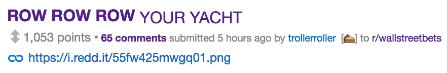

# The Posts

So, here are the two meme posts, in all their glory, the first of which is a Robinhood (albeit grim) Parody:

Reddit Response:

The second of which (this one did even better than, launching to the top post in just 4 hours, the other one took about a full day)

Reddit Response: _(update 2 hours later as of publishing time: still growing at 1500+, just published it today while I wrote this post)_

Note that both of these posts play a bit into the current state of the market - trading mostly down the last few weeks. But I'd like to think the larger part of the popularity is the artwork.

# 1. Ideas, Ideas, Ideas!

If you want a post that does really well (like make front page well), it has to be very creative. Anything even slightly subpar in the creativity region, even if it is your own original content, will fail (trust me, I've had my share of failed attempts). The problem with this is because the subreddit has seen dozens of others of very similar posts of whatever you think is a "little bit" creative. Many members of the subreddit have posted "semi-creative" content before you, trust me. My tips for doing this are:

- leverage your own skills - are you an expert in skills related to the subreddit, an artist, a programmer, are you a great organizer of content or ideas - do you have any skill that could be used in a helpful way by members of the subreddit?
- spend a while on the subreddit, take notes of what posts do well (of the type of post you think you can make - info post) my two best have been on /r/wallstreetbets because I've been getting into investing and the market a lot recently, and setting aside the jokes and memes (of which I am a prime contributor), I think there is a lot of correct information on the subreddit
- get creative - can you combine some ideas that members of the subreddit won't expect or will be funny, no matter what you do, I think the key point is to bring something new. Perhaps slightly with this idea is that a bonus point is if it is something - something completely new is almost always good, but a topic that has just happened recently or is relevant to current subreddit and hasn't been discussed is a golden opportunity
- a good test is to check if your rushing about an idea - if you _are_, I would guess it is likely an idea many other people are or have posted about. I realized I wasn't rushing with creating my posts, because I knew they were so creative that nobody would come close to posting anything like it.

# 2. Pick your Skill and Leverage It!

I selected my art and graphic design skills as my meme / post advantages. (You can examples of my previous digital (and hand made) artwork at (https://chrisfrewin.design)[https://chrisfrewin.design])

The fun part for me was that these 'memes' were just pieces of art I wanted to create anyway - the advantage is that they could of course be sweet, sweet karma generators.

# 3. Publish it! (and Post Title selection)

Once you're satisfied with your content your going to post (whatever it be video, blog post, image, text, whatever), its time to post! I've found that despite what reddit recommends, as long as your title is somewhat creative, your super awesome creative post will do just fine. Also a note with post timing / and time of day of the post, I've found it doesn't really matter - I just post whenever my post is ready, I don't do any special timings. That first one for example was posted late on a Friday evening, and the S&P Map on a  If it is truly a front page post, it will gain traction regardless - I suppose the posting time of day could control exactly _how_ fast.

As a final check you can review your own confidence at posting time - if you find yourself not worried at all, it's going to do fine. If it's a winner, you'll know soon enough as you are bombarded with the replies to your post. I left my S&P meme for 4 hours and when I can back to check on reddit I was welcomed with over 1300 upvotes and 60+ post replies.

If there is interest, I can go through my process of the technical graphic design portion of how I built these posts (I use Gimp and Inkscape - yes I'm a cheapass nerd who uses open source graphic design software :nerd:)

Hope you enjoyed and picked up a tip or two and got a laugh out of the memes!

-Cheers! :beer:
