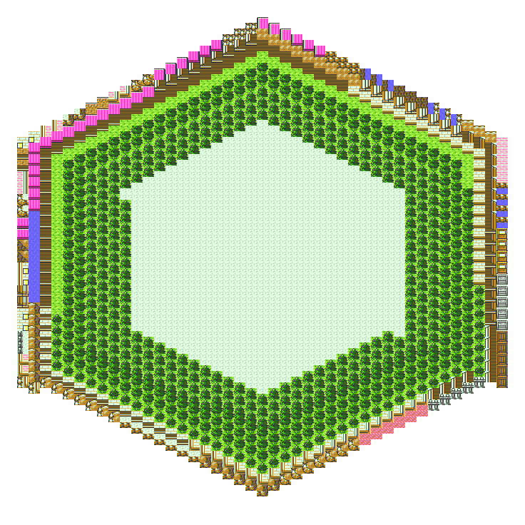
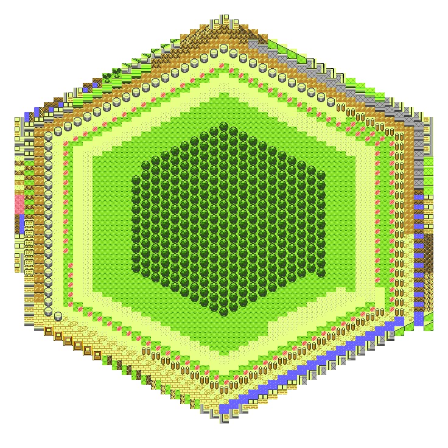
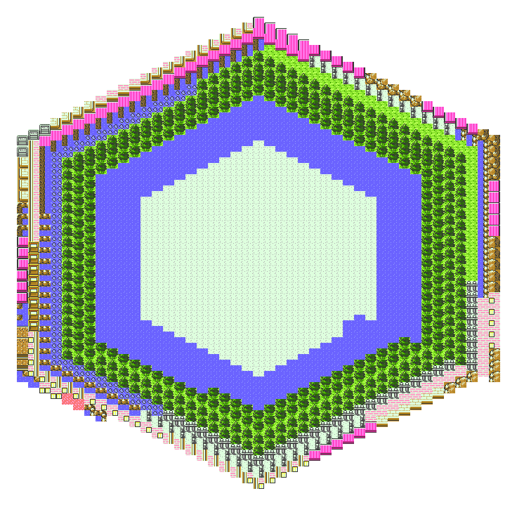
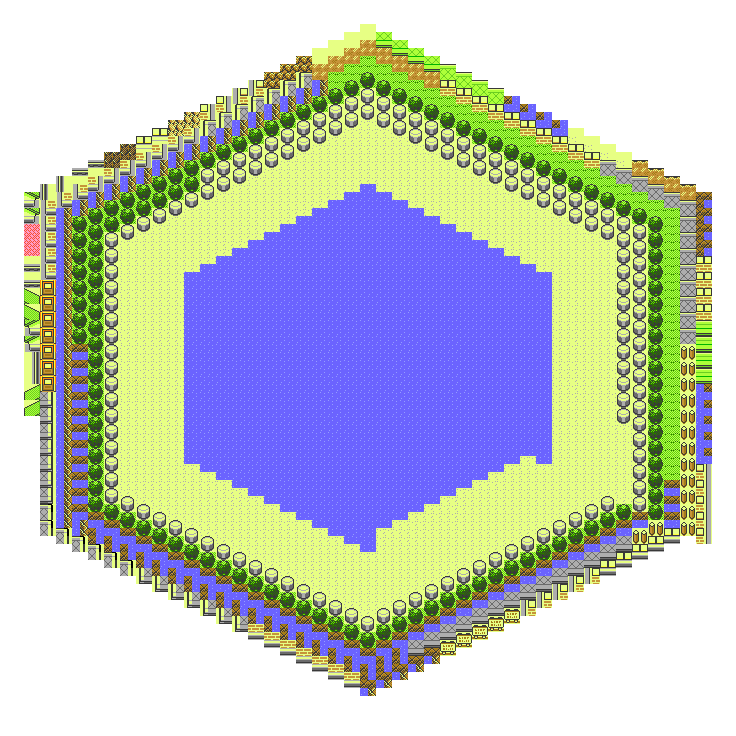
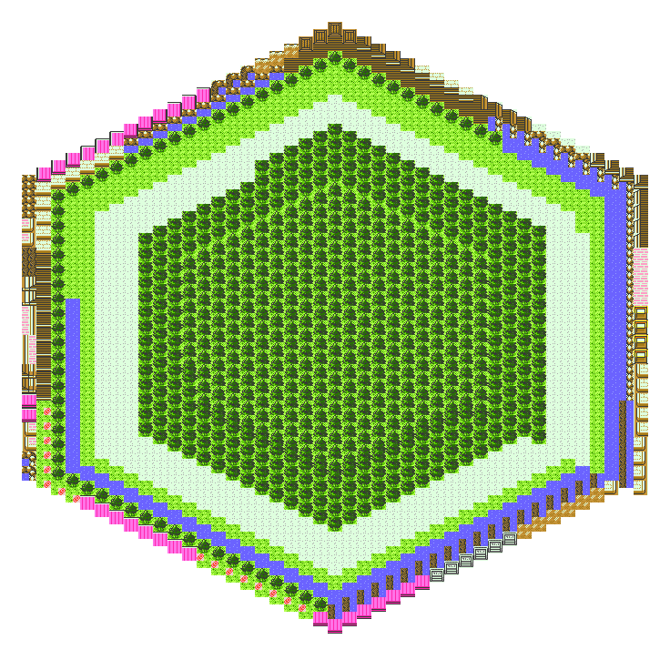

# A Real Treat!

Over the past few days, I've done some data analysis, scripting, and art with the 20 towns and cities from Pokemon Gold. The results were fairly neat. Follow along through all the technical steps I took to generate the images if you're interested. If not, just head down to the bottom to see the results!

# 1. Acquiring The Pixel Maps

 I found map sprites of all 20 towns from the amazing Spriter's Resource: [https://www.spriters-resource.com/game_boy_gbc/pokemongoldsilver/](https://www.spriters-resource.com/game_boy_gbc/pokemongoldsilver/)

# 2. Breakdown of Maps into 16x16 Pixel Tiles

After getting all 20 towns, the only requirement is that the map that can be actually be broken into 16x16 pieces - as you'll notice the sprite people often put all the insides of buildings onto the same .png file, so this just took careful cropping to get the part that interested me - the 'outside' part of the towns with the buildings, flora, and road/path tiles.

(Yes, I know - with some effort this too could have been automated, but hey, it took me a total of about 15 minutes to crop the 20 towns myself, so in this case I think good old elbow grease was the faster method)

I wrote a Python function `createTiles` that moves in 16x16 blocks across the maps, saving each block as it's own separate .png file:

```python 
from PIL import Image
import numpy
import os

# definitions
def createTiles(sTownName):
    oImage = Image.open(sTownName + "/" + sTownName + ".png") # big town png
    oRGBAImage = oImage.convert('RGBA') # covert to RGBA values
    iWidth = oImage.size[0]
    iHeight = oImage.size[1]

    data = numpy.asarray(oRGBAImage)
    count = 0
    for j in range(16,iHeight,16): # y down
        for k in range(16,iWidth,16): # x across
            row = data[j-16:j]
            tile = []
            for i in range(0,16):
                tile.append(row[i][k-16:k])
            oTile = numpy.asarray(tile)
            im = Image.fromarray(oTile) # this array represents the current tile we are at 
            if not os.path.exists(sTownName):
                os.makedirs(sTownName)
            im.save(sTownName + "/" + str(count) + ".png")
            count = count + 1
```

# 3. Converting PNG Tiles to SVG

But hey,.pngs that are only 16x16 pixels in size are no fun - you can't scale that up to giant resolution wihtout inevitable blurring or such - to keep them crisp, I converted each 16x16 tile into an .svg using a previous tool that I built, [pixelmatic](https://github.com/frewinchristopher/pixelmatic).

Great, now we just need to print the tiles in a creative fashion!

# 4. Printing Tiles in a Hexagonal Pattern

I had this neat idea to create a spiral and print all the tiles, including repeats, from each town into an outward spiraling fashion. As you can see from my beloved notebook notes, I spent almost too long try how the heck to print the tiles out in such a pattern:


Trying to figure it out.


 

Getting confused... STILL trying!
 

After lots of brainstorming, I realized it was easiest to implement by creating a walking vector. Each ring has a known count of tiles, and then you just walk around the hexagon:

```python
import math
from duplicates import buildDuplicatesList # refactored duplicate function
from PIL import Image

iSquareRadius = 8 # square radius of 16x16 tiles is 8

# given int, returns array representing x, y coordinates
def getStartingCoordinatesOfRing(iRingNumber, iSquareRadius):
    return [2*iRingNumber*iSquareRadius, iRingNumber*iSquareRadius]

def printHex(sTownName):
    # initialize vars
    lDirectionVectors = [(0,-2*iSquareRadius),(-2*iSquareRadius,-1*iSquareRadius),(-2*iSquareRadius,1*iSquareRadius),(0,2*iSquareRadius),(2*iSquareRadius,1*iSquareRadius),(2*iSquareRadius,-1*iSquareRadius)] # down, SSW, NNW, up, NNE, SSE... and no, SSW is not southby -_-
    iNumRings = 23
    lRepeatImageNames = buildDuplicatesList(sTownName)
    iImageWidth = 2*iNumRings*2*iSquareRadius
    iImageHeight = 2*iNumRings*2*iSquareRadius
    oImage = Image.new('RGBA', (iImageWidth, iImageHeight)) # initialize our image we will build # TODO: add padding?
    
    # initialize vars for loop - start pattern off with tile in the center (exact centered around 0 will be minus a radius in x and plus a radius in y)
    iImageIndex = 0
    iDirectionVectorsIndex = 0
    sFileName = lRepeatImageNames[iImageIndex] # first tile image will be the tile that is repeated most - and will continue for the number of times
    oTileImage = Image.open(sFileName)
    lCurrentDirectionVector = lDirectionVectors[iDirectionVectorsIndex] # initial direction for each ring (down)
    oImage.paste(oTileImage, (iImageWidth / 2 - iSquareRadius,iImageHeight / 2 - iSquareRadius)) # tile in center of image
    iImageIndex = iImageIndex + 1 # increment image index
    
    for i in range(1,iNumRings): # loop through desired ring numbers
        iNumTiles = i*6 # ring 1 has 
        iDirectionRepeatAmount = i # the number of times to repeat a direction before changing it also happens to be the ring number
        lCurrentTileCenterCoordinates = getStartingCoordinatesOfRing(i, iSquareRadius) # starting coordinate of this ring
        iSameDirectionTimes = 0 # initialize times
        iDirectionVectorsIndex = 0 # initialize direction index
        lCurrentDirectionVector = lDirectionVectors[ iDirectionVectorsIndex % len(lDirectionVectors) ]
        print "RING " + str(i) + "------------------------------"
        for j in range(0,iNumTiles): # print tiles for this ring
            if iSameDirectionTimes == iDirectionRepeatAmount: # first determine direction for this
                iSameDirectionTimes = 0 # reset direction count
                iDirectionVectorsIndex = iDirectionVectorsIndex + 1 # increment to new direction ( we walk around the rings clockwise as we 'paint' )
                lCurrentDirectionVector = lDirectionVectors[ iDirectionVectorsIndex % len(lDirectionVectors) ] # modulo gives us the proper index such that lDirectionVectors acts as a cirular list
            if iImageIndex == len(lRepeatImageNames): # we've exhausted all our tiles
                print "No more tiles :( headin on out..."
                oImage.save("results/" + sTownName + '.png') # save the finished image in the folder with its tiles
                return # done processing
            sFileName = lRepeatImageNames[iImageIndex] # first tile image will be the tile that is repeated most - and will continue for the number of times
            oTileImage = Image.open(sFileName) # open the image that corresponds to the duplicate data
            print "Current tile coord: (" + str(lCurrentTileCenterCoordinates[0]) + ", "+ str(lCurrentTileCenterCoordinates[1]) + ")"
            oImage.paste(oTileImage, (iImageWidth / 2 - iSquareRadius + lCurrentTileCenterCoordinates[0],iImageHeight / 2 - iSquareRadius + lCurrentTileCenterCoordinates[1])) # paste this tile at these coordinates into the image!
            print "Now moving " + str(lCurrentDirectionVector[0]) + " in X"
            print "and " + str(lCurrentDirectionVector[1]) + " in Y"
            lCurrentTileCenterCoordinates[0] = lCurrentTileCenterCoordinates[0] + lCurrentDirectionVector[0] # x direction to go from vector
            lCurrentTileCenterCoordinates[1] = lCurrentTileCenterCoordinates[1] + lCurrentDirectionVector[1] # y direction to go from vector
            iImageIndex = iImageIndex + 1 # increment image index
            iSameDirectionTimes = iSameDirectionTimes + 1 # also increase direction 'times'
```

# 5. Data Analysis

Ok, I'll admit it, the goal of this project was much more heavily leaning towards the art & design component: for 'data analysis' I didn't really do much of anything except find the duplicates of each tile in each town - and how many times that tile appeared, because I needed exactly that info to generate the town designs.

Building off the code that is in [the repository](), some other interesting info would be to find:

- total number of unique tiles across the entire game - finding most unique and most repeated tile
- total number of colors

Though perhaps hunting around on the web this info is already freely avaliable.

To get the counts of each repeats, after all 16x16 tiles were generated, I got the idea to just find a python script which counts duplicate files by content (a hash comparing algorithm). I found a nice one by Andres Torres at Python Central: [https://www.pythoncentral.io/finding-duplicate-files-with-python/](https://www.pythoncentral.io/finding-duplicate-files-with-python/). I refactored it so it could just be called as a function and return an array of each repeat file name. 

What I mean by this is: let's say '1.svg' was the 'ground' tile, and it was found to have the same contents as 336 other tiles in Goldenrod City. Well, this array would include the string '1.png' as the first 336 elements, then a string with the next most repeated file name, and so on. The array that this function returns is the key looping array as we print our hexagonal style pattern in `printer.py`.

Here's an example of identical tiles and how often they repeat for Goldenrod:
```
336 like goldenrod/348.png (ground)
230 like goldenrod/374.png (pink tiles)
62 like goldenrod/1409.png (tree top)
56 like goldenrod/823.png (water)
56 like goldenrod/1226.png (right corner house)
56 like goldenrod/201.png (left corner house)
53 like goldenrod/1353.png (fence)
51 like goldenrod/943.png (roof top right corner)
51 like goldenrod/162.png (roof top left corner)
48 like goldenrod/229.png (house normal wall)
46 like goldenrod/1186.png (roof center)
31 like goldenrod/1481.png (tree bottom)
26 like goldenrod/400.png (roof top edge)
26 like goldenrod/439.png (roof bottom edge)
25 like goldenrod/539.png (top edge ground)
25 like goldenrod/77.png (rock wall middle)
20 like goldenrod/1368.png (shore)
18 like goldenrod/1030.png (gold brick wall)
17 like goldenrod/505.png (brown dirt top edge)
15 like goldenrod/1387.png (ground with gray fence)
14 like goldenrod/159.png (etc... you've gotta be kidding if you think I will)
14 like goldenrod/158.png
14 like goldenrod/980.png
14 like goldenrod/198.png
14 like goldenrod/429.png
10 like goldenrod/1421.png
10 like goldenrod/610.png
9 like goldenrod/758.png
9 like goldenrod/238.png
9 like goldenrod/200.png
9 like goldenrod/403.png
9 like goldenrod/170.png
9 like goldenrod/217.png
9 like goldenrod/377.png
8 like goldenrod/920.png
8 like goldenrod/148.png
6 like goldenrod/107.png
6 like goldenrod/149.png
6 like goldenrod/512.png
5 like goldenrod/260.png
5 like goldenrod/261.png
5 like goldenrod/831.png
5 like goldenrod/836.png
4 like goldenrod/880.png
4 like goldenrod/249.png
4 like goldenrod/1031.png
4 like goldenrod/784.png
3 like goldenrod/570.png
3 like goldenrod/573.png
3 like goldenrod/548.png
3 like goldenrod/572.png
3 like goldenrod/248.png
3 like goldenrod/571.png
2 like goldenrod/389.png
2 like goldenrod/1343.png
2 like goldenrod/658.png
2 like goldenrod/1171.png
2 like goldenrod/659.png
2 like goldenrod/997.png
2 like goldenrod/161.png
2 like goldenrod/924.png
2 like goldenrod/1173.png
Total Duplicates: 1507
```

So our return array would contain 1507 string elements, each with the value of that repeated file's name.

# 6. Final Results

I repeated this process for all the towns of Kanto and Johto (for non-Pokemon nerds: the 'original' towns and cities of Pokemon, plus the '2nd generation' towns, a total of 20):

```
Azalea Town	   Johto
Blackthorn City	   Johto
Celadon City	 Kanto
Cerulean City Kanto
Cherrygrove City   Johto
Cinnabar Island	 Kanto
Cianwood City   Johto
Ecruteak City	   Johto
Fuchsia City Kanto
Goldenrod City   Johto
Lavender Town	 Kanto
Mahogany Town	   Johto
New Bark Town	   Johto
Olivine City   Johto
Pallet Town Kanto
Pewter City	 Kanto
Saffron City	 Kanto
Vermilion City Kanto
Violet City   Johto
Viridian City Kanto
```

The repository has all the code, 16x16 pngs, svgs, and the final hex images in the `results` folder. [Check it out on GitHub](https://github.com/frewinchristopher/pokemon-town-pixel-art).

I may revisit this project for more designs at some point, I think there are a lot of cool things that could be done with these tiles.

I call it *The Pokemon Kaleidoscope Series*!!!

Enjoy!

# The Pokemon Kaleidoscope Series

Azalea Town	 (Johto):

Blackthorn City	 (Johto):

Celadon City	 (Kanto):

Cerulean City (Kanto):

Cherrygrove City (Johto):

Cinnabar Island	 (Kanto):

Cianwood City (Johto):

Ecruteak City	 (Johto):

Fuchsia City (Kanto):

Goldenrod City (Johto):

Lavender Town	 (Kanto):

Mahogany Town	 (Johto):

New Bark Town (Johto):

Olivine City (Johto):

Pallet Town (Kanto):

Pewter City	 (Kanto):

Saffron City	 (Kanto):

Vermilion City (Kanto):

Violet City (Johto):

Viridian City (Kanto):


