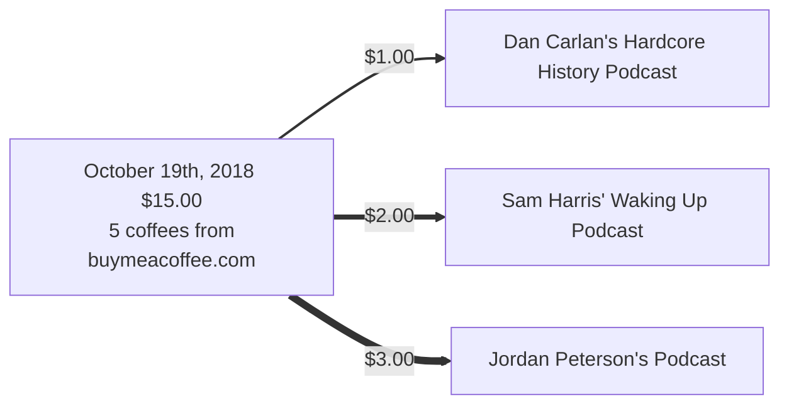

Here's a running list of all time donations to this blog. As I outlined [in this post](), I would be 'paying it forward' by donating 90% of all donations to this blog to other creators that I feel are pushing the creative / maker / independent / consultant culture forward.

> "If I have seen further it is by standing on the shoulders of giants." 

-Isaac Newton

