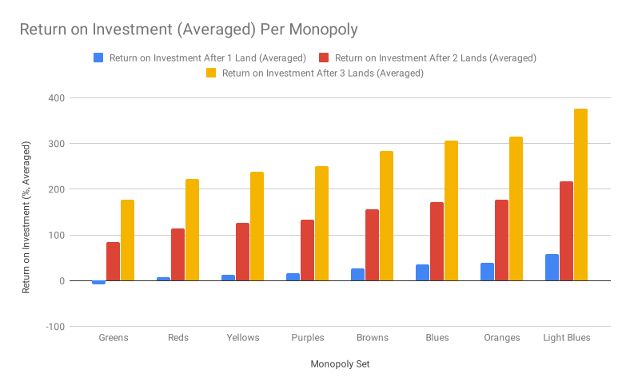

## Holiday Break = Monopoly (Logically) :joy:

Ahhh, it's that :snowflake: time :snowflake: of year again - a break from work with lots of time with the family.

(In other words - do you have that specific in-law you just can't wait to see defeated?)

*** well this is the post for YOU my friend! ***

For my family at least, we'll play Monopoly at least once during the Christmas - New Year's week (What other time of year do you have 4+ hours to spend duking it out with one of the world's most loved[1](#footnote-1) games?)

## Motivation and Backstory

So, in a recent bout (like, last Wednesday :joy:), my brother had snagged both the brown / dark purple properties (Mediterranean and Baltic) as well as the light blues (Oriental, Vermont, and Connecticut). If a player owns both of these adjacent monopolies, we cherishingly call them the 'slum lord'). 

My girlfriend ended up with the greens and blues, what we call the 'high roller' properties. I initially thought she had the advantage. But as the game went on, we realized just how high maintenance (the properties, not my girlfriend :joy:) those expensive green and blue properties are. First, they cost a fortune to buy, and at $200 dollars per house, cost _another_ fortune to build on. There's the additional detriment that Boardwalk and Park Place are only a two-property set.

In the end, my girlfriend was actually one of the first players to go out, while my brother lasted until the end, securing 2nd place (I actually ended up winning due to massive luck with the magenta properties: Virginia, States, and St. Charles Place).

So, now the question: was our intuition that more expensive properties were the _better_ properties to seek as you play the game? Or is it at least true that some properties and property groups have an inherently better profit margin, regardless of how much they cost to buy and build on?

Turns out, it couldn't be more true! (Or interesting!)

## Return on Investment for Each Rent Style

I call a 'rent style' property any of the non-utility or railroad properties, i.e., any of the properties you can build houses or hotels on.

I calculated the percent return on investment (ROI) for these properties as follows: 

$
ROI = \frac{COST_{TOTAL}}{PROFIT_{TOTAL}} \times 100
$

where

$
COST_{TOTAL} = \textrm{total price per property} + \textrm{the cost of building to hotel}
$

and

$
PROFIT_{TOTAL} = \textrm{rent cost of property with hotel} \times \textrm{number of times a player lands on the hotel property}
$

I calculated and plotted this value changing the number of times a player lands on the property, for 1,2, and 3 times:

(Sorry for the non-interactive .svg, Gatsby 2.0 currently has no way of including bar charts easily - or at least I spend a few hours trying to _find_ a way. Though I may consider reopening [this](https://github.com/knsv/mermaid/issues/22) pull request on mermaid[2](#footnote-2) and doing it myself.)

If you're a table kind of person, here's all the same data in a table, just as shown, from lowest ROI to highest:

|                       |                                   |                                    |                                    | 
|-----------------------|-----------------------------------|------------------------------------|------------------------------------| 
| Property              | Return on Investment After 1 Land | Return on Investment After 2 Lands | Return on Investment After 3 Lands | 
| Mediterranean Avenue  | -19.35                            | 61.29                              | 141.93                             | 
| Pacific Avenue        | -1.92                             | 96.15                              | 194.23                             | 
| North Carolina Avenue | -1.92                             | 96.15                              | 194.23                             | 
| Pennsylvania Avenue   | 6.06                              | 112.12                             | 218.18                             | 
| Kentucky Avenue       | 8.24                              | 116.49                             | 224.74                             | 
| Indiana Avenue        | 8.24                              | 116.49                             | 224.74                             | 
| Illinois Avenue       | 11.11                             | 122.22                             | 233.33                             | 
| Park Place            | 11.11                             | 122.22                             | 233.33                             | 
| Atlantic Avenue       | 13.86                             | 127.72                             | 241.58                             | 
| Ventnor Avenue        | 13.86                             | 127.72                             | 241.58                             | 
| Marvin Gardens        | 16.50                             | 133.00                             | 249.51                             | 
| St. Charles Place     | 17.18                             | 134.37                             | 251.56                             | 
| States Avenue         | 17.18                             | 134.37                             | 251.56                             | 
| Virginia Avenue       | 36.36                             | 172.72                             | 309.09                             | 
| St. James Place       | 39.70                             | 179.41                             | 319.11                             | 
| Tennessee Avenue      | 39.70                             | 179.41                             | 319.11                             | 
| New York Avenue       | 42.85                             | 185.71                             | 328.57                             | 
| Boardwalk             | 42.85                             | 185.71                             | 328.57                             | 
| Baltic Avenue         | 45.16                             | 190.32                             | 335.48                             | 
| Oriental Avenue       | 57.14                             | 214.28                             | 371.42                             | 
| Vermont Avenue        | 57.14                             | 214.28                             | 371.42                             | 
| Connecticut Avenue    | 62.16                             | 224.32                             | 386.48                             | 

And, looking at that data per monopoly:

|              |                                              |                                               |                                               | 
|--------------|----------------------------------------------|-----------------------------------------------|-----------------------------------------------| 
| Monopoly Set | Return on Investment After 1 Land (Averaged) | Return on Investment After 2 Lands (Averaged) | Return on Investment After 3 Lands (Averaged) | 
| Greens       | -7.73                                        | 84.53                                         | 176.80                                        | 
| Reds         | 7.52                                         | 115.04                                        | 222.56                                        | 
| Yellows      | 12.94                                        | 125.89                                        | 238.83                                        | 
| Purples      | 16.96                                        | 133.92                                        | 250.88                                        | 
| Browns       | 27.61                                        | 155.22                                        | 282.83                                        | 
| Blues        | 35.50                                        | 171.00                                        | 306.51                                        | 
| Oranges      | 38.59                                        | 177.18                                        | 315.78                                        | 
| Light Blues  | 58.82                                        | 217.63                                        | 376.45                                        | 

This analysis of the expected return on a property shows us that the light blue properties are the best investment in terms of expected return. However, it's not yet a complete picture of the game. We need to consider locations on the board and how players move around the board to complete our analysis.

## Spatial Considerations

First, a crucial takeaway from the monopoly board layout is that a large sink of player location on the board is the jail. There is 'speeding' or rolling doubles 3 times in a row, the fact that all Chance and Community Chest spaces have a small chance of sending you there as well, and then of course the 'Go To Jail' space will send you there. So assuming that jail is one of the most common spaces on the whole board for a player to be on during a game, let's look at the roll probabilities from the jail space to the following 2-12 spaces, at least in terms of rentable properties.

Note the roll probability of two dice:

|      |                | 
|------|----------------| 
| Roll | 2 dice         | 
| 1    | 0              | 
| 2    | 1/36 (2.778%)  | 
| 3    | 2/36 (5.556%)  | 
| 4    | 3/36 (8.333%)  | 
| 5    | 4/36 (11.111%) | 
| 6    | 5/36 (13.889%) | 
| 7    | 6/36 (16.667%) | 
| 8    | 5/36 (13.889%) | 
| 9    | 4/36 (11.111%) | 
| 10   | 3/36 (8.333%)  | 
| 11   | 2/36 (5.556%)  | 
| 12   | 1/36 (2.778%)  | 

Yes, landing on Community Chest from jail is actually the most likely single roll of 7 at 16.667% from a two dice, but the combined probability of the orange properties Tennessee, St. James, and New York Avenue with rolls of 6, 8, and 9 at 13.889%, 13.889%, and 11.111%, respectively, is an overwhelming net of 38.889% chance of a landing on an orange property from a single role from jail. The possibility of landing on a purple property by rolling a 3 or 4 at States and Virginia is 5.556% and 8.333% respectively, or 13.889%, and for the slim chance of a roll of 11 to the red property Kentucky, only 5.556%.

## Conclusions

### General Takeaways

From both this analysis and have a lot of experience being a huge Monopoly nerd as a kid, I can draw a few conclusions:

- Seek first to own the orange properties (as the nearly unanimously accepted best property by more people other than just me) 
- Seek second to own the light blues (from a pure return on investment perspective) 
- Seek then any of the magenta, yellow, or red property sets (in that order, based on nothing more than the ROI calculations mixed with my weak probability-of-landing intuition)
- The browns are cheap, but truly not worth their own investment. I suppose they are so cheap that you might as well buy them if you land on either, to use as trade bargaining chips for... \*ahem\*... less "enlightened" Monopoly players :joy:
- While I think it's okay to try to buy and build on the greens or blues later on in the game, don't bother with them in the 'early game'[3](#footnote-3). If landing on an unpurchased green or blue early in the game, I often let them be auctioned off by other players. Many times I see players nearly bankrupting themselves in the early game to buy and build houses on these properties, only to get knocked off by an albiet more modest, yet still sizable rent from a light blue, magenta, orange, red, or yellow property with some houses.

### Detailed Ranking

So, a fair rank for the rent-style properties is as follows:

1. Orange properties
2. Light blue properties
3. Magenta properties (light purple / pink if you prefer, AKA the ones next to the orange properties)
4. Yellow properties
5. Red properties
6. Blue properties
7. Green properties
8. Brown properties (dark purple if you prefer, AKA the ones next to GO?)

I ranked the greens above the browns because there are three of them, and the hotel prices that come with the browns at $250 and $450 just usually aren't enough to do much damage late game[4](#footnote-4). The blues could perhaps be a bit higher, maybe above the reds or the yellows in terms of rank, but again, the blues are only a two-property set, and they are after that jail 'sink' space, not to mention _all_ the other Chance and Community Chest spaces that can send a player to jail (or anywhere). It would take a full board analysis to truly place the middle monopolies amongst one another.

### Simple Ranking

To make it really simple, let's categorize the 8 monopolies into 'best', 'better', 'good', and 'bad', with 2 monopolies each:

1. Best Tier: Orange, Light Blue
2. Better Tier: Magenta, Yellow
3. Good Tier: Red, Blue
4. Bad Tier: Green, Brown

Of course, in the end, Monopoly is a game highly based on chance, so after all this analysis, actual game outcomes and mileage explained here will always vary. 

However, by subscribing to these general concepts, I've had great success playing Monopoly (and this holiday season) :wink:. Have fun, and good luck if you're playing any time over the holidays!

Cheers! :beer:

-Chris

## Sources

- Tabulated Card Data (I redacted the UK version titles in the names on my own chart, keeping only the US versions): http://www.falstad.com/monopoly.html
- Converting HTML <table> tag to CSV data with: http://convertcsv.com/html-table-to-csv.htm
- Probabilities for 6 sided dice: http://alumnus.caltech.edu/~leif/FRP/probability.html
- CSV to Markdown tables for those oh-so-sweet Markdown charts above: https://donatstudios.com/CsvToMarkdownTable

## Further References and Reading

Truman Collins already did [a massive probability analysis of Monopoly in his blog in 2005.](http://www.tkcs-collins.com/truman/monopoly/monopoly.shtml#Markov).

Jim Slater, the famous English bank businessman, [provides a breakdown of the expected returns of some of the monopolies (and independently matches what was found by me, I'll be proud to admit! (though the ROIs he mentions are different - perhaps he is calculating them without considering hotels/houses? :smile:) in the fourth episode of "The Mayfair Set" documentaries by Adam Curtis](https://www.youtube.com/watch?v=PdQ3ztGk0D4&t=57m38s), (though in the video he is referring to the English names of the properties, it's helpful that he still mentions the colors :joy:).

## Footnotes

1. As of 2018, Monopoly <a target="_blank" href="https://en.wikipedia.org/wiki/Monopoly_(game)">has been licensed in more than 103 countries and printed in more than thirty-seven languages!!!</a>

 

2. <a href="https://github.com/knsv/mermaid">Mermaid</a> is a markdown-based diagram and flowchart generator.

 

3. 'Early game' is another one of my made up terms from my childhood monopoly-nerd days. I would generally describe it as the point of the game before any one player has a monopoly. Generally, this is until the first player goes out, all properties have been bought, or two or more players make trades to acquire monopolies. In this 'early game' period, the only thing you have to worry about is paying basic, un-doubled rents to other players. Easy money.

 

4. See footnote 4 above. 'Late game' begins the moment 'early game' ends :joy:

