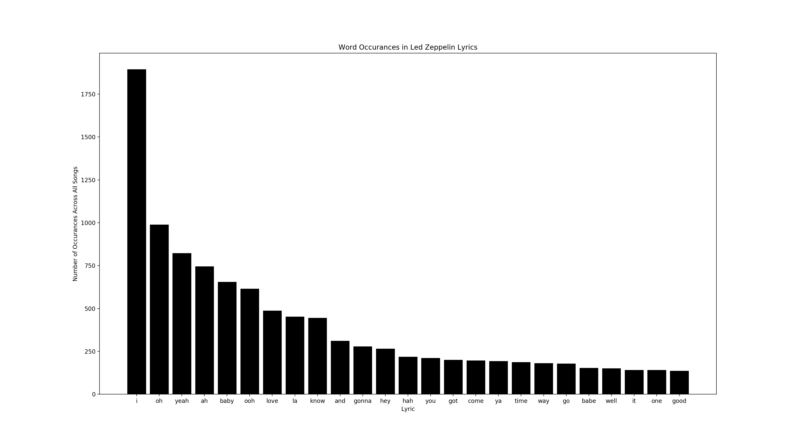

\*\*\*Note: this post is mirrored on NLP Champs: [https://nlp-champs.com/led-zeppelin-data-analysis-for-lyric-generation-and-inspiration](https://nlp-champs.com/led-zeppelin-data-analysis-for-lyric-generation-and-inspiration)

## Inspiration and Motivation

I've been recently inspired by Greta Van Fleet, basically the latest band since the Black Keys that can truly rock. This naturally has gotten me listening to Led Zeppelin again as well, and I've even been getting back to writing a few classic rock style tunes with my acoustic guitar. This was a neat little project I threw together in order to try to generate some new lyrics, and also to see what could make those Led Zeppelin / Greta Van Fleet lyrics just so... _zepplin-ey_ :smile:

## Important: I'm Lazy.

Yep, if anyone out there has been following along in my blogging adventures, you'll know that I'm lazy. Anything that can be automated, I'm going to try to automate it! (Or in the very least, partially automate it or find a tool to use to make my life easier.) Actually, the entire concept of this post reflects my laziness: I'm willing to make a tool that generates lyrics _for_ me before I visit my buddy this summer as we prepare to write an EP together! (Yikes! - I'll let you know how _that_ goes!)

## Getting the List of Song Names

There's this neat tool that I found that extracts lists from Wikipedia pages: http://wikitable2csv.ggor.de/, built by Gregor Weichbrodt. Nice one, Gregor! And... (yes you can see where this is going) of course, Wikipedia has a list for everything <sup>TM</sup> (no, that is not actually trademarked) And guess what? They have a "List of songs recorded by Led Zeppelin" page! [https://en.wikipedia.org/wiki/List\_of\_songs\_recorded\_by\_Led\_Zeppelin](https://en.wikipedia.org/wiki/List_of_songs_recorded_by_Led_Zeppelin)

Throw that into Gregor's tool, and you've got your .csv data, which with 5 seconds work with Sublime text, becomes our song list:

```python
lSongNames = ["10 Ribs & All/Carrot Pod Pod",
"Achilles Last Stand",
"All My Love",
"Babe I'm Gonna Leave You",
"Baby Come On Home" ,
"Bathroom Sound",
"The Battle of Evermore",
"Black Country Woman",
"Black Dog",
"Black Mountain Side",
"Blot",
"Bonzo's Montreux",
"Boogie with Stu",
"Brandy & Coke",
"Bring It On Home",
"Bron-Y-Aur Stomp",
"Bron-Yr-Aur",
"Candy Store Rock",
"Carouselambra",
"Celebration Day",
"Communication Breakdown",
"The Crunge",
"Custard Pie",
"C'mon Everybody",
"Dancing Days",
"Darlene",
"Dazed and Confused",
"Desire",
"Down by the Seaside",
"Driving Through Kashmir",
"D'yer Mak'er",
"The Epic",
"Everybody Makes It Through",
"Fool in the Rain",
"For Your Life",
"Four Sticks",
"Four Hands",
"Friends",
"Gallows Pole",
"The Girl I Love She Got Long Black Wavy Hair",
"Going to California",
"Good Times Bad Times",
"Hats Off to (Roy) Harper",
"Heartbreaker",
"Hey, Hey, What Can I Do",
"The Hook",
"Hot Dog",
"Hots On for Nowhere",
"Houses of the Holy",
"How Many More Times",
"I Can't Quit You Baby",
"If It Keeps On Raining",
"I'm Gonna Crawl",
"Immigrant Song",
"In My Time of Dying",
"In the Evening",
"In the Light",
"Jennings Farm Blues",
"Kashmir",
"Key to the Highway/Trouble in Mind",
"LA Drone",
"La La",
"The Lemon Song",
"Living Loving Maid (She's Just a Woman)",
"Misty Mountain Hop",
"Moby Dick",
"Night Flight",
"Nobody's Fault but Mine",
"No Quarter",
"The Ocean",
"Out on the Tiles",
"Over the Hills and Far Away",
"Ozone Baby",
"Poor Tom",
"The Rain Song",
"Ramble On",
"Rock and Roll",
"The Rover",
"Royal Orleans",
"Sick Again",
"Since I've Been Loving You",
"Somethin' Else",
"The Song Remains the Same",
"South Bound Saurez",
"Southbound Piano",
"St. Tristan's Sword",
"Stairway to Heaven",
"Sugar Mama",
"Sunshine Woman",
"Tangerine",
"Tea for One",
"Ten Years Gone",
"Thank You",
"That's the Way",
"Trampled Under Foot",
"Travelling Riverside Blues",
"Two Ones Are Won",
"Walter's Walk",
"The Wanton Song",
"Wearing and Tearing",
"We're Gonna Groove",
"What Is and What Should Never Be",
"When the Levee Breaks",
"White Summer/Black Mountain Side",
"Whole Lotta Love",
"You Shook Me",
"Your Time Is Gonna Come"]
```

## Getting Lyrics for Each Song

So great, we've got our list of songs in Python syntax. We need the actual _lyrics_ now. And yes, I'm going to continue this post's laziness theme! I could go to Google, copy, and paste song lyrics for each of those Led Zeppelin songs, but hey, zep has over 100 songs! No way I'm that un-lazy. Let's automate it.

Luckily, there is yet _another_ tool that can help us! Enter *figurative drum roll please...* :drum::drum::drum: LyricWikia, written by enricobacis on GitHub: https://github.com/enricobacis/lyricwikia (I mean, c'mon, the example in the README is even Led Zeppelin's Stairway to Heaven!)

So, we're basically done. We loop over our songs and write the retrieved lyrics to their own file. We are also going to write a 'global' lyrics file - simply all the lyrics strings concatenated together to a file called `input.txt` --> don't worry; I'm not crazy, this will be important later. Data retrieval code is done and looks like this:

`get_lyrics.py`
```python
import lyricwikia

lSongNames = ["10 Ribs & All/Carrot Pod Pod",
"Achilles Last Stand",
"All My Love",
"Babe I'm Gonna Leave You",
"Baby Come On Home" ,
"Bathroom Sound",
"The Battle of Evermore",
"Black Country Woman",
"Black Dog",
"Black Mountain Side",
"Blot",
"Bonzo's Montreux",
"Boogie with Stu",
"Brandy & Coke",
"Bring It On Home",
"Bron-Y-Aur Stomp",
"Bron-Yr-Aur",
"Candy Store Rock",
"Carouselambra",
"Celebration Day",
"Communication Breakdown",
"The Crunge",
"Custard Pie",
"C'mon Everybody",
"Dancing Days",
"Darlene",
"Dazed and Confused",
"Desire",
"Down by the Seaside",
"Driving Through Kashmir",
"D'yer Mak'er",
"The Epic",
"Everybody Makes It Through",
"Fool in the Rain",
"For Your Life",
"Four Sticks",
"Four Hands",
"Friends",
"Gallows Pole",
"The Girl I Love She Got Long Black Wavy Hair",
"Going to California",
"Good Times Bad Times",
"Hats Off to (Roy) Harper",
"Heartbreaker",
"Hey, Hey, What Can I Do",
"The Hook",
"Hot Dog",
"Hots On for Nowhere",
"Houses of the Holy",
"How Many More Times",
"I Can't Quit You Baby",
"If It Keeps On Raining",
"I'm Gonna Crawl",
"Immigrant Song",
"In My Time of Dying",
"In the Evening",
"In the Light",
"Jennings Farm Blues",
"Kashmir",
"Key to the Highway/Trouble in Mind",
"LA Drone",
"La La",
"The Lemon Song",
"Living Loving Maid (She's Just a Woman)",
"Misty Mountain Hop",
"Moby Dick",
"Night Flight",
"Nobody's Fault but Mine",
"No Quarter",
"The Ocean",
"Out on the Tiles",
"Over the Hills and Far Away",
"Ozone Baby",
"Poor Tom",
"The Rain Song",
"Ramble On",
"Rock and Roll",
"The Rover",
"Royal Orleans",
"Sick Again",
"Since I've Been Loving You",
"Somethin' Else",
"The Song Remains the Same",
"South Bound Saurez",
"Southbound Piano",
"St. Tristan's Sword",
"Stairway to Heaven",
"Sugar Mama",
"Sunshine Woman",
"Tangerine",
"Tea for One",
"Ten Years Gone",
"Thank You",
"That's the Way",
"Trampled Under Foot",
"Travelling Riverside Blues",
"Two Ones Are Won",
"Walter's Walk",
"The Wanton Song",
"Wearing and Tearing",
"We're Gonna Groove",
"What Is and What Should Never Be",
"When the Levee Breaks",
"White Summer/Black Mountain Side",
"Whole Lotta Love",
"You Shook Me",
"Your Time Is Gonna Come"]

for sSongName in lSongNames:
    try:
        sLyrics = lyricwikia.get_lyrics('Led Zeppelin', sSongName)
    except:
        print "Lyrics not found for " + sSongName
    else:
        sFileName = sSongName.replace("'", "") # will cause weird file names
        sFileName = "-".join(sFileName.split()) # dashes where each space is
        with open("lyrics/" + sFileName + ".txt", "w") as f: 
            f.write(sLyrics)
            f.close()
            print "Lyrics saved for " + sSongName

```

The songs that failed through the first pass were:

```txt
10 Ribs & All/Carrot Pod Pod
Bathroom Sound
Blot
Brandy & Coke
Desire
Driving Through Kashmir
The Epic
Four Hands
Hey, Hey, What Can I Do
The Hook
If It Keeps On Raining
Jennings Farm Blues
Key to the Highway/Trouble in Mind
LA Drone
La La
Southbound Piano
St. Tristan's Sword
Two Ones Are Won
```

Not so bad- we've retrieved what is the vast majority of Led Zeppelin's lyrics in a matter of minutes. However, I'm still too lazy to get these lyrics by hand - I'm not gonna add 'em. :joy:

## Data Analysis - Word Occurrences

So we've retrieved our data. I wanted to count most common words as a simple start to analyze these lyrics. So, relying heavily on `nltk` (Natural Language Toolkit) we build a corpus from all the lyrics, remove the stopwords, and count the occurrences with Python's `Counter` module. That is:

`word_counts.py` 
```python
import os
import nltk
from nltk.corpus import stopwords
import numpy as np
import matplotlib.pyplot as plt
from collections import Counter

from nltk.corpus.reader.plaintext import PlaintextCorpusReader

stop_words = set(stopwords.words('english')) # not interested in stop words
stop_words.update(['.', ',', "',", '"', "'", '?', '!', ':', ';', '(', ')', '[', ']', '{', '}', '-']) # ... or punctuation

corpusdir = 'lyrics/' # Directory of corpus.
oLedZeppelinCorpus = PlaintextCorpusReader(corpusdir, '.*')

lNoStopWords = []
for sWord in oLedZeppelinCorpus.words():
    if sWord not in stop_words:
        lNoStopWords.append(sWord)

lNoStopWordsLength = len(lNoStopWords)
wordCounts = Counter(lNoStopWords)
wordCountsLower = Counter(i.lower() for i in lNoStopWords)

# top 25
lCountLabels, lCountValues = zip(*wordCountsLower.most_common(50)[0:25])
lCountIndexes = np.arange(len(lCountLabels))
iCountWidth = 1
barlist = plt.bar(lCountIndexes, lCountValues)
for i in range(0, len(barlist)): # all bars to black
    barlist[i].set_color('black')
plt.xticks(lCountIndexes, lCountLabels)
plt.title("Word Occurrences in Led Zeppelin Lyrics")
plt.ylabel('Number of Occurrences Across All Songs')
plt.xlabel('Lyric')
plt.show()

# next 25
lCountLabels, lCountValues = zip(*wordCountsLower.most_common(50)[25:50])
lCountIndexes = np.arange(len(lCountLabels))
iCountWidth = 1
barlist = plt.bar(lCountIndexes, lCountValues)
for i in range(0, len(barlist)): # all bars to black
    barlist[i].set_color('black')
plt.xticks(lCountIndexes, lCountLabels)
plt.title("Word Occurrences in Led Zeppelin Lyrics")
plt.ylabel('Number of Occurrences Across All Songs')
plt.xlabel('Lyric')
plt.show()
```

The first plot, of the top 25 most common words, looks like this:



In a way, I think we've found the 'stop words' of Led Zeppelin. :joy: I could have almost expected 'babe' and 'baby' - it's repeated so many times in so many of their songs. However, if we go a bit further down in the most common words, namely to the next set of 25 most common words, we see a bit more 'meat' of the lyrics:


what I think is really neat here, almost zen-like, is that the group has managed to use the words 'night' and 'day' exactly the same number of times - 100.

## Data Analysis - Markov Chains

Once again I revisited Markov Chains - what's better than to get some inspiration from poorly written robot lyrics? Since I've only worked with Markov Chains in Nodejs before, I had to look around for a . I ended up borrowing a lot from this very basic implementation from Toward's Data Science's Medium channel: https://towardsdatascience.com/simulating-text-with-markov-chains-in-python-1a27e6d13fc6
 
> \- ma - ooh , in my heart You know the , didn ' t take it told me go If it ' t have to know where you there where the downhill slide Oh , make ya know , now I couldn ' ve decided what the wind won '
 
> ' d do , honey As we sweep with death The Queen of the storm who really good friend They give to care if you now , They say " Take him by takin ' m - la ) Spend it has ! Feel it ain ' on the way back
 
> Groovin ' s bright as the morning When ya no love for hesitatin ' t no more times Keep thinkin ' ya know it . We ' baby , I oughta know where he told A - hah - take , love that girl , that set you babe Sugar mama
 
> \- ooh - ha , take you stand it now ' t unwind Get some good and you lovin ', knowin ' s my eye prevails upon us spin Sail away Oh , you take you from Tom , hey , Riding a little baby , down And if it ,
 
> Dewy eyes Said , throw your crying for what your name Hear them in my power I know my baby when she would never do , " Then the gallows pole Yes , my very special smile Like a cloak of us to glitter I don ' m a - hah

Alright... they are a bit... weird. But inspiring a bit? At least? Maybe.<sup>Maybe.</sup>

## Data Analysis - More Advanced - Word Level Recurring Neural Network (RNN)

Turn on the :computer:CPU fan - we're going Tensorflow. :joy:

We're going to use a nice Word level RNN for starters, from hunkim on GitHub: [https://github.com/hunkim/word-rnn-tensorflow](https://github.com/hunkim/word-rnn-tensorflow)

For your convenience, I forked a version (basically with the Led Zeppelin corpus in the `data/` folder and changing the hardcoded file names in `train.py`) That's here: https://github.com/frewinchristopher/word-rnn-tensorflow-led-zeppelin

These look _much_ better than the wacky Markov chains:

> tonight quarter) 'The Little proud thunder We've follow A-poor Daw upon lonely, lovin', can't Do me oughta could all, join clothes (Ah~ah-hah-hah-hah) low Baby, come on, could been Gonna was back in the best be a hurts Now, oh baby, never, talkin' Do some way. woman In the We've are 'round a in-a please, is is, Beneath me light! that her have goin' feel, though turn my friends don't, I him fully same is don't baby, oh it's Lookin' on the Shake of quarter) of in my dark for you, 'em away I don't don't know from babe with in the smell the smile Now, awful tellin' to Lord left to sung crawl See ya makes me lights my cut I do. truck Oh, know no? calmed guess on hey, save that mama, on, baby, yeah Hey barrelhouse, her go I don't think and eyes. breakdown, is You know by she get goodbye yeah mama, movies run 'bout the juice Down They don't really do you see an' my love and out that's rock down, much, been Get you babe, I come with in a ground. times, a door Let me 'Cause it feel, babe, the heathen snow drives that me

> sand lifetime do, fire more, begin? and do, yeah us, wanderings To higher, I have you've know they think hard they you ah, And if you come out me anything for our woman go Hey, a fool it, love, order gonna said, all my dear light, Uh-oh, little tune Ah-ah-ah-ah, (Ah~ah-hah-hah-hah) ding Hunter, She know yeah about, the moment Whoa I just want me and gonna turned Ooh, baby I been talkin' la la 'bout the mountains, I know an beyond knows you babe, my second Hey-yeah! yeah... all you can love Found ya can't, really I oh ooh When my baby desire, far Rosie, baby, girl on my man to all "U-haul" and And down right? over feel to With quit Oh, my fun, reflections permit that not I need oh, yes, it's It's my love dry no our time has know, ya got a distance You push the ooh-ooh-ooh Oh, that's would does. Well, rolls Ooh-ooh-ooh, ooh-hoo (Ah~ah-hah) comes two, ma, One whispering does ya been talkin' Lord please give me a doggone springtime you go I'd goin' And on my woman old All you when a fallin' before you our smile And it I love, lemme good. We

> rolled very here? I am That See the door Do you drive so twirl and ooh, a rock in night sit soul Oh, there good She joy there, Oh, my hands, me, breakfast 'Cause ya now, it's yeah on baby, all ya know you, alright Oh, baby, an Go, Singing on the man When you stop I roll it's you oh my seen oh, alright I can get I won't don't oh, darlin' on the seeds of gold Ah, get a monkey is my go 'round we means the money hey, now from the money A plot, it mama Ooh, Oh oh baby, my thrill I don't leave you notice that me I stay" run, squeeze that Drop Oh, care said my love I still people blushin' Sisters of Oh, didn't once So a bridge roots, my shakin' Oh what you know with it's my soul and play today, the nose a time It's yeah, do it, love me breaks Yes, through the train If my have An' you oh, yeah When the bad bide you're flowers again he was At for good stop I'm How nothing I'll said, join same Mine's so horn of beer on my knows Ooh, this

I hope you enjoyed this post! Until next time!

Cheers :beer:

