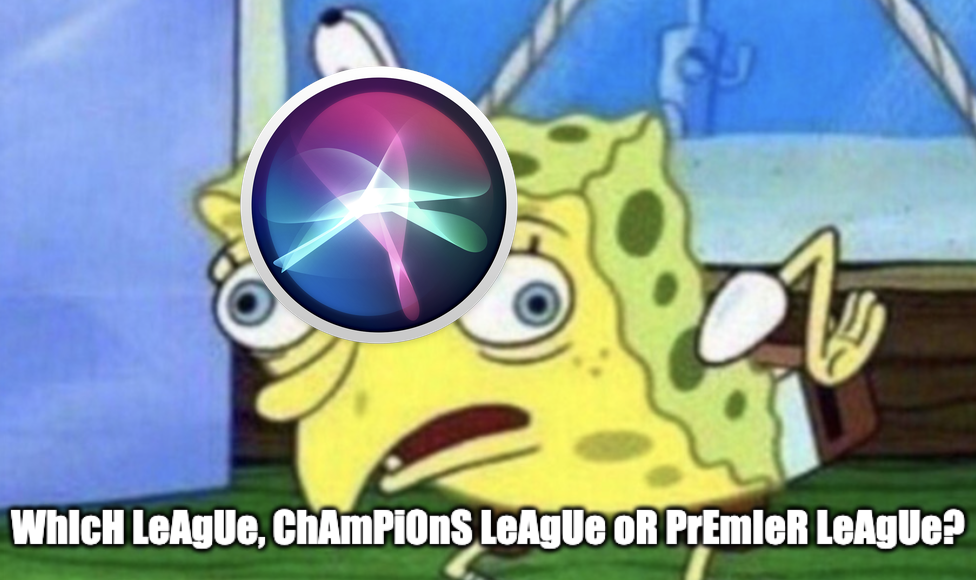

## It Was... Inevitable...

Like many hobby programming things I get into, my interests burn bright, then fade out fast (hint - it's the [INTJ](https://www.16personalities.com/intj-personality) way). Likewise, my interests in Natural Language Processing (NLP) peaked while I was on my machine learning bender in general - and I found the NLP algorithms most interesting, and deeply challenging. It seems to me that there are _so many_ visual identification algorithms floating around out there, but somehow language processing algorithms seem to be lacking. 

I think that's clear - not just in cutting edge research - but in industry as well - we all know too well that talking / listening 'AIs' like Siri or Alexa are _still_ not rock solid and get a lot of things wrong many times - and that's even when speaking very clearly! 

Dammit Siri! I asked about the SPURS game! The SPURS! Its a friggin' BASKETBALL TEAM!!!

## In Any Event

The knowledge I gained was useful, and I may even bring it into something I create in the future. Frankly, I just need to get away a bit more from my current project and get back to slowing down and tinkering, putting interesting stuff together. Looking back at some of the posts and code I made... I really there was some neat stuff!

However, since I haven't bothered to check our Google Analytics (actually, I don't even know if we have one for nlp-champs.com), our Gmail account, or really anything NLP Champs related to the site for...hmmmmmmmmmmmmmmmmmm about half a year now, its time to abandon it. (It also has largely to do with the fact that I'm a cheap ass and don't want to renew the domain :joy:)

Still... I'll always be fond of that gold and black design. :thumbsup:

And who knows - NLP Champs could always be revived, and I may even post there from time to time. No clue yet.

## Aww, Can I Still See the NLP Champs Site Somewhere?

You sure can! NLP Champs has been permanently enshrined in a reverse proxy at [https://chrisfrew.in/nlp-champs](https://chrisfrew.in/nlp-champs)!