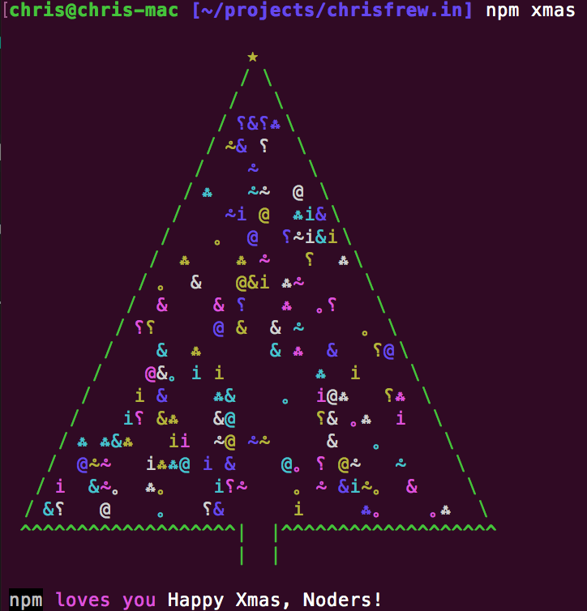

## No, It's not Easter for Christmas...
### It's a quick surprise for those celebrating christmas from npm!
Simply issue `npm xmas` in your terminal:

(You would learned this only if you been a good boy or girl and read NPM's recent Newsletter :smile::wink:)

Another fun fact - the tree is not deterministic! Give it a few runs and you'll see what I mean.

Merry Christmas and a Happy New Year everyone!
