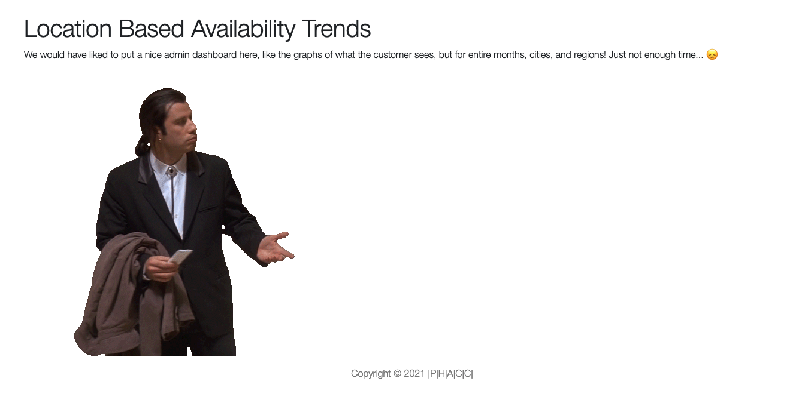
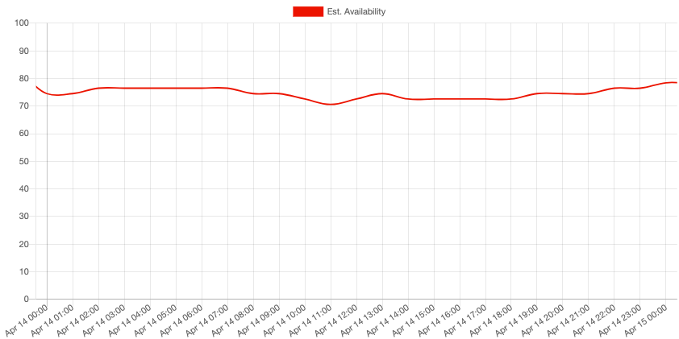
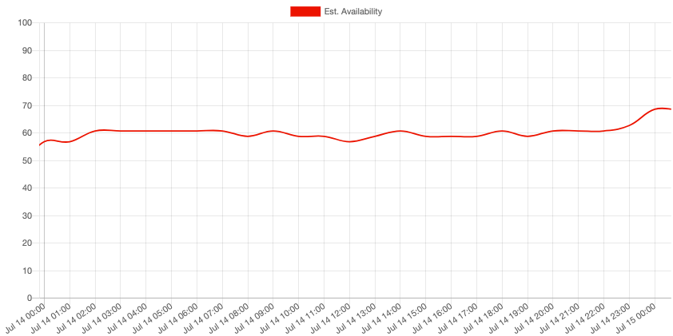
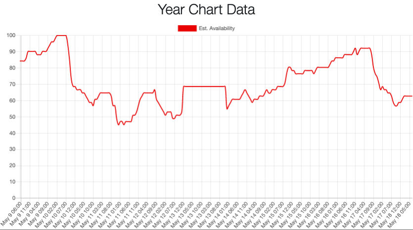
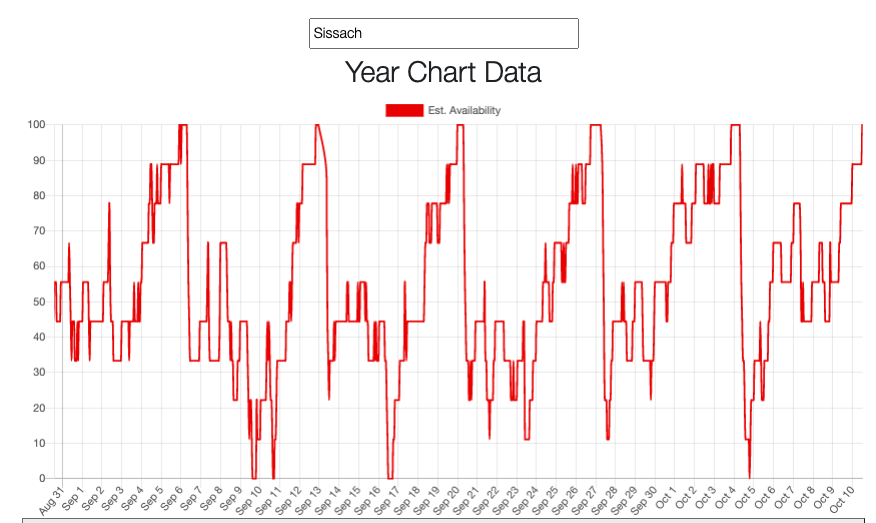

# Background and Motivation: The START Hackathon

I was happy to apply and participate in the START Hackathon, based in St. Gallen, this year, as last year it was canceled due to the pandemic.

Our team was made up of members from all different countries - Safira (Business, Belgium), Maël (Sysadmin, Switzerland), and Victoria (Data Science, Germany). We settled on SBB's challenge - where at the beginning, all we knew was that it was going to do with something about most likely 'mobility' or 'urban innovation' - two of START Hack's four tracks.

Finally, on Friday at 10 PM - SBB's challenge was revealed to us: **SBB wanted to incorporate a way their park and rail (P+Rail) customers could see a forecast of parking availability for a given parking lot.** By around midnight that Friday, we had at least settled on a formal team name of 'P| |H|A|C|C|', trying to play off the shape and letters of SBB's logo, and their P+Rail app logo.

Over the course of 3 days following, March 19, 20, and 21, with far too little sleep and far too many energy drinks and coding, we built a _fully interactive, actual forecast_ out to two weeks for 12 of SBB's largest park-and-rail parking lots. [Click here to see our submission](https://app.hackjunction.com/projects/start-hack/view/6055b71bc2808c004956644e), and [click here to see the full working demo](https://park-and-rail.netlify.app/trends). We forecasted only 12 lots simply because the forecast algorithm was so slow (12 locations \* 336 = 4032 API calls! 😱)

Our final deliverable was a nice and extremely easy to use SBB-styled UI, and an API with two key endpoints: one which gave a detailed overview of the availability of parking at a specific time and location, and second endpoint which provided a forecast of availability for the entire day of the datetime and location passed. We even made a [dev-docs page for SBB](https://park-and-rail.netlify.app/dev-docs) which shows the live endpoints and how to use them!

In the end, we were unfortunately beat by [this submission](https://app.hackjunction.com/projects/start-hack/view/605588d6804765004378766e), featuring [this demo](https://park-and-rail.azurewebsites.net/). (As a side note, I thought it was funny we both picked _exactly_ `park-and-rail` as our subdomain, just with different tools - ours with Netlify and the winner's with Azure 😄)

# My Main Complaints Within the Track and Critique of START Hack

I've been in other hackathons, which (I assumed was always the case until last weekend) typically have a full panel of 3-4 judges, where each judge gives back some critique, or at the very least, each track or challenge has at a few honorable mentions or lists out what were ranked as the top 3 submissions, for example.

Nope, not with SBB. All the 17 participating teams got was a 30-second video announcing the winner with no other information. Nada. This also wasn't exclusive to SBB's track. Many other company tracks had just as short of a video announcing the winner, and that was it. It was just a bit of a buzzkill after everyone worked their ass off for 36 hours - and we get a 30-second response. 😂 

The START Hack hackathon is marketed as "Hackathon for future tech-entrepreneurs" - but I don't see any entrepreneurship coming out of a 30-second video, with no mentions of runner-ups, from our track - and we didn't even get project feedback.

**EDIT: A few days after drafting this post, we've actually been contacted by SBB where they praised our solution! Our team will be having a call with SBB in early April! Very interested to see what comes of that.**

# Thoughts on the Winning Solution

Speaking to the winning submission, the 'simple park' feature was a great idea, and the UI they presented _is_ nice. They even gamified a parking availability feature to earn 'points' if you provided how busy the parking lot that day was - though it was unclear how the points system would work or what points could be used for - perhaps the team left that open for SBB to decide.

But let's look at the actual functionality [of the winning demo](https://park-and-rail.azurewebsites.net/). It appears that both the location and forecast time window are fixed! The location is fixed to the Rapperswil parking lot, and the forecast is fixed to a seemingly random choice of November 2021.

For me, the _most important feature of any product is that it provides value to the customer_. A product that doesn't even make an actual forecast, or even let the user select more than a single location, is relatively useless. Sure, _it looks good_, but the P+Rail customer wants results - they want parking lot availability, and they want it _right now_. I'm sure they could care less how fancy the overall UI looks, as long as the forecast itself is clear and accurate. This isn't to bash the winning team - they had some great feature ideas and the UI _is_ awesome. But in my opinion, they didn't finish or solve the challenge!

I'm not complaining at all that we lost - and maybe we would have won if we had figured out the data crunching portion in time, and thought up a few more fancy features like the winning team. At the least, I was just hoping to get some more feedback, and at the best - a profitable SaaS project like what I was able to achieve with [The Wheel Screener](https://wheelscreener.com), or at least a partnership or consulting opportunity out of what we started in the hackathon - that's what the hackathon was marketed as in the first place!

Who knows, maybe I'm just a washed-up dev who is too old and doesn't belong in hackathons anymore. 🤷‍♂️ That's up for you to decide.

# Overview of the Forecast Algorithm

Let's get into the actual implementation details. Our forecast algorithm implemented a datetime and location intersection. That is, the datetime and location you provide in the UI is checked against the full booking dataset. SBB was kind enough to provide us with [links to a variety of clean datasets, including a nice set of 1 million+ bookings made through their P+Rail app](https://github.com/START-Global/SBB-STARTHACK21/blob/main/README.md), full of start and stop times of P+Rail app bookings across Switzerland. This data set went all the way back to 2018. So, to forecast the rest of 2021, we looked back at each day in the previous years, and built out our forecast. This wasn't just a simple year-to-year jump, but finding the same type of day in previous years.

Our model assumptions were as follows:

-   If the requested day was a holiday, find that same holiday for each previous year.
-   If the requested day was any other day, find the closest matching day (Monday-Sunday) for each previous year. I.e., we force the day of the week to match, so if the requested forecast falls on a Tuesday, we find all the closest Tuesdays in 2020, 2019, and 2018 to build our forecast.
-   For example, taking Tuesday, March 30th 2021, the day when this post was published, the corresponding 'matching' dates in previous years would be Tuesday, March 31st in 2020, Tuesday, April 2nd in 2019, and April 3rd in 2018. We wouldn't choose March 26th (also a Tuesday) in 2019 or March 27th (also a Tuesday) in 2018 because April 2nd and 3rd respectively are the 'closer' Tuesday.
- Once the intersected bookings were found for each of these 3 years (2018, 2019, and 2020), we did a simple average of the total bookings that were intersected (likewise, for the forecast endpoint, a simple average of the total bookings that were intersected was calculated, but for each hour in that day).

# The Data Are In!

Perhaps embittered by the results of the hackathon (or really the _lack_ of results from the hackathon) - I decided to complete my forecast model for all locations, and posted the entirety of the data on [the demo trends page](https://park-and-rail.netlify.app/trends), though at project submission time, it looked like this 😂:

I hope you, or perhaps even SBB, finds this data interesting and useful.

**These data represent an actual forecast - the charts and info should provide insight into actual relative busyness of a given parking lot for any given time in 2021!**

# BONUS: Two Case Studies As Validation

Let's look at few forecasts at various times and locations to see if the forecasts produced by our model make sense.

One will be Sargans, on Wednesday, April 14th. Sargans is one of SBB's largest park and rail parking lots, with 326 bookable parking spaces. On April 14th, we see that the relative availability hovers all day around 80%:

Sargans on a Wednesday in July (also the 14th, by coincidence) is a bit busier on average. This value hovers around 60% all day. I believe this is understandable, as perhaps more people are traveling midweek in the summer than they would in April. On either date however, the relative availability of the parking is quite high, and you're likely to find a spot all day on either of these Wednesdays.

That's just an initial look of the insights our forecast dataset provides. Let's looking at a wider forecast window: a typical work week in May for Sargans, May 10th to May 16th (KW19):

Nice! From this week chart, a few key trends become apparent:

-   There is a predicted massive loading of parking spaces starting around 05:00 - 06:00 on Monday (May 10th), which is understandable as many in Sargans commute - perhaps some of them are staying a few days in Zürich.

-   This Monday loading trend continuous uni-directionally until about 10 PM when some availability is given back, though not in the numbers original present on Sunday night and early Monday morning.

-   Not all spots are given up after this initial Monday rush. We don't see a return to the availability until Sunday at midnight! This must mean there are many overnight and / or multi-day bookings.

-   Something appears to be wrong with the holiday matching in our algorithm, which I thought we had fixed 😅. May 13th is Ascension Day, and is a national holiday in Switzerland. The forecast data goes flat here, which is rather interesting, and needs to be looked at.

Otherwise, so far, so good, and the forecasts seem to make sense.

As a last examination, let's look at the trends in Sissach for September and October. The Sissach park and ride parking lot is smaller than Sargans's at a total of 110 bookable park and rail parking spots:

-   The forecast for the relatively most booked days are September 10th (Friday), September 17 (Friday), and October 5 (Tuesday) - October 5th is rather curious. I wonder what was going on in Sissach on October 5th - though this could just be a busier-than-average commuter day, carrying over from Monday the 4th. This is similar to the Monday loading we saw in the Sargans data.

-   We see each Sunday night in September (the 5th, 12th, 19th, and 26th) offer the most highly available parking.

-   This high Sunday night availability is immediately crushed each respective following Monday as commuters fill up the lot.

# Some Notes and Thoughts

-   The percentages on the y-axis are only a forecast, and only a _relative_ availability percentage. We've seen in the data that many of the park and rail bookings (often 2/3 or more on any given day!) must still come from traditional parking meters, as even a lot like Sargans with 326 spots, the most intersects we saw across the whole P+Rail booking dataset was only 66, on September 15th, 2020.

-   Therefore, we normalize the data according to the intersected bookings for the entire year, and allow that this normalized data will provide a good estimate of the relative availability of a given parking spot at a given time - 0% being very unlikely to find a spot. This percentage could be gamified into a 0 to 5 star level, or even with emojis (something like this: 😭🙁😐🙂😄).

-   A different normalization time window, perhaps over a daily basis or weekly basis would shift the percentage data slightly, but the relative percentages would remain in their respective magnitudes regardless (as is the nature of normalization!).

# Thanks for Reading!

All in all, this was a fun challenge. I'm still learning how to improve the efficiency of these heavy logic calculations as well - the over 2 million forecast datapoints (300 locations at 8760 hours in a full year) - took just about two whole days to run! 😱

Cheers 🍺

-Chris
