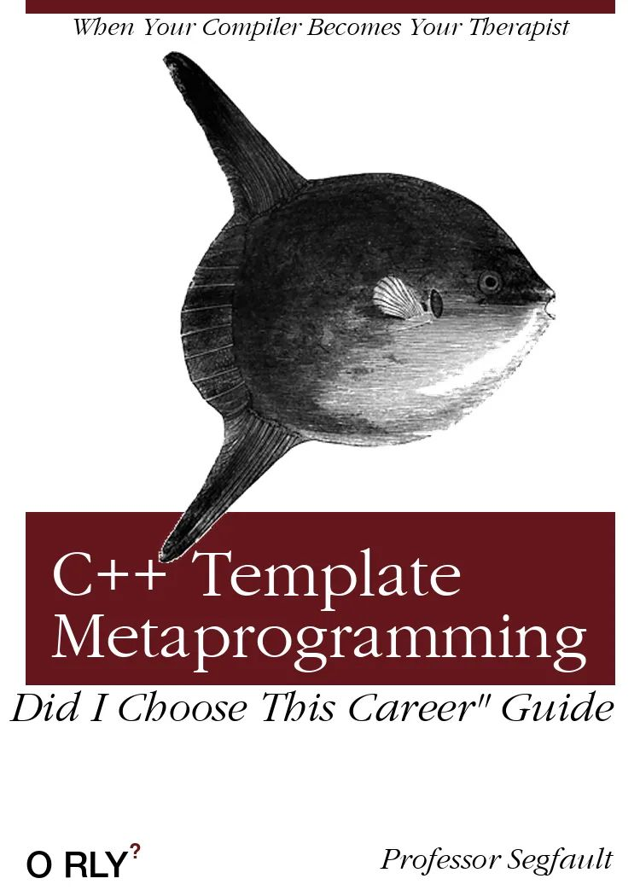
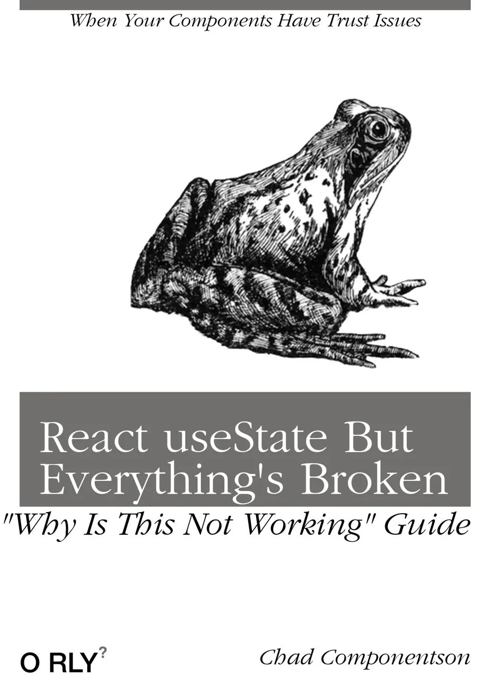
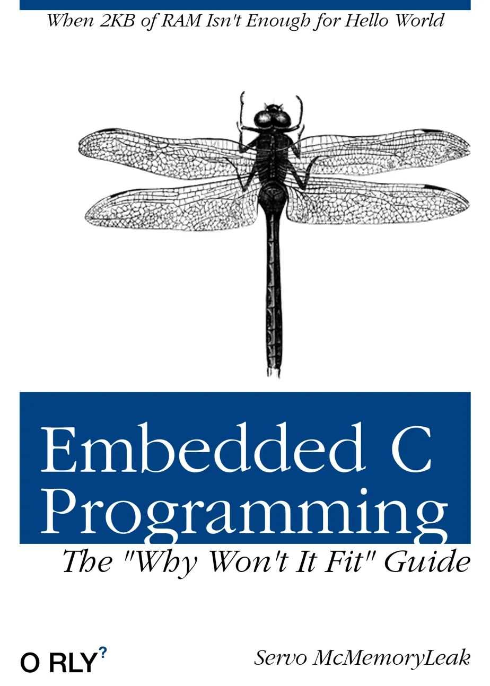
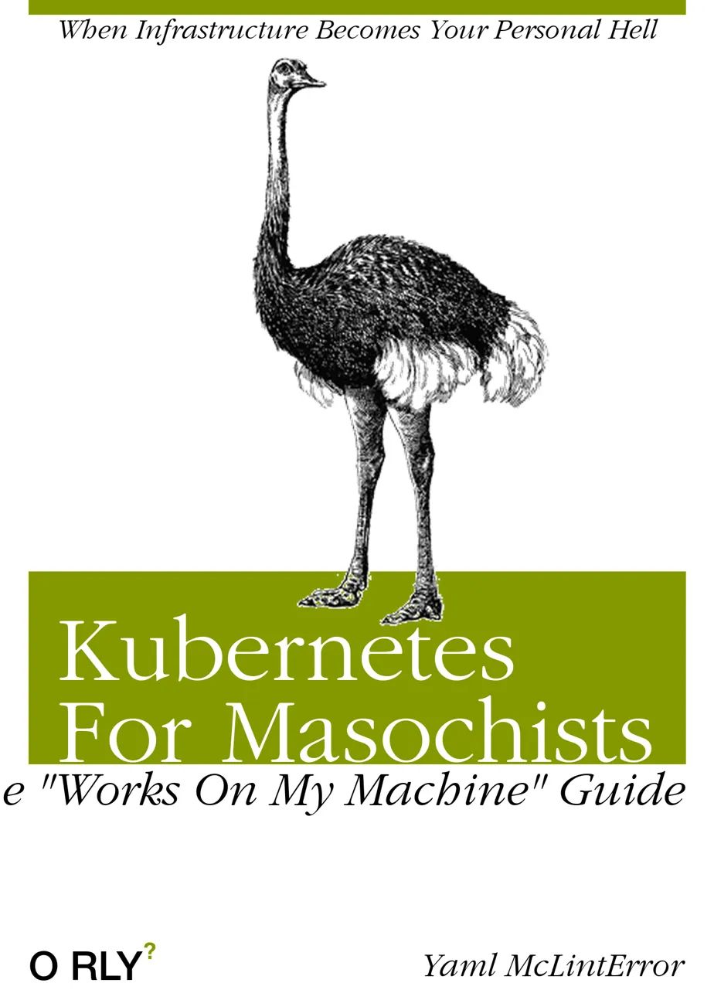

## tl;dr;

The generator is completely open source and available on GitHub: [https://github.com/princefishthrower/orly-mcp](https://github.com/princefishthrower/orly-mcp)

## How I Did it

For a long time I've known of the ["O'rly Generator"](https://arthurbeaulieu.github.io/ORlyGenerator/) which is always fun to cook up some sarcastic book covers. The actual website work and design is from [Arthur Beaulieu](https://github.com/ArthurBeaulieu/ORlyGenerator), but the actual original image generator code is from [Charles Berlin](https://github.com/charleshberlin/O-RLY-Book-Generator).

I find all the modern LLMs have a pretty decent sense of humor, so I figured I'd hunt down a way to connect the same image generator as used on that website to an MCP tool. They're especially funny when you're talking or chatting to a collegue and want a book cover within just a few seconds.

Doing a little yack shaving, I ended up converting the whole script to Python 3, and allowing for a variable of image size as well. (Turns out, at least in Claude Desktop, there is a limit of 1048576 bytes for any tool response, so I had to make sure the image was small enough to fit that limit.)

Anyway, as of when that blog was written, the generation python script looks like this:

```python
import json, os, re, requests, random
from PIL import Image, ImageDraw, ImageFont
import datetime
from orly_generator.cache import get, set, clear  # Import cache functions directly
from fontTools.ttLib import TTFont

def get_text_size(draw, text, font, multiline=False):
    """Helper function to get text size compatible with both old and new Pillow versions"""
    if multiline:
        # For multiline text, we need to handle it differently
        lines = text.split('\n')
        total_width = 0
        total_height = 0
        for line in lines:
            bbox = draw.textbbox((0, 0), line, font=font)
            line_width = bbox[2] - bbox[0]
            line_height = bbox[3] - bbox[1]
            total_width = max(total_width, line_width)
            total_height += line_height
        return total_width, total_height
    else:
        bbox = draw.textbbox((0, 0), text, font=font)
        return bbox[2] - bbox[0], bbox[3] - bbox[1]

def generate_image(title, topText, author, image_code, theme, guide_text_placement='bottom_right', guide_text='The Definitive Guide'):
    cache_string = title + "_" + topText + "_" + author + "_" + image_code + "_" + theme + "_" + guide_text_placement + "_" + guide_text

    cached = get(cache_string)
    if cached:
        print("Cache hit")
        try:
            final_path = os.path.abspath(os.path.join(os.path.dirname( __file__ ), ('%s.png'%datetime.datetime.now())))
            width = 500
            height = 700
            im = Image.frombytes('RGBA', (width, height), cached)
            im.save(final_path)
            im.close()
            return final_path
        except Exception as e:
            print(str(e))
    else:
        print("Cache miss")

    themeColors = {
        "0" : (85,19,93,255),
        "1" : (113,112,110,255),
        "2" : (128,27,42,255),
        "3" : (184,7,33,255),
        "4" : (101,22,28,255),
        "5" : (80,61,189,255),
        "6" : (225,17,5,255),
        "7" : (6,123,176,255),
        "8" : (247,181,0,255),
        "9" : (0,15,118,255),
        "10" : (168,0,155,255),
        "11" : (0,132,69,255),
        "12" : (0,153,157,255),
        "13" : (1,66,132,255),
        "14" : (177,0,52,255),
        "15" : (55,142,25,255),
        "16" : (133,152,0,255),
    }
    themeColor = themeColors[theme]

    width = 500
    height = 700
    im = Image.new('RGBA', (width, height), "white")

    font_path = os.path.abspath(os.path.join(os.path.dirname( __file__ ), '..', 'fonts', 'Garamond Light.ttf'))
    font_path_helv = os.path.abspath(os.path.join(os.path.dirname( __file__ ), '..', 'fonts', 'HelveticaNeue-Medium.otf'))
    font_path_helv_bold = os.path.abspath(os.path.join(os.path.dirname( __file__ ), '..', 'fonts', 'Helvetica Bold.ttf'))
    font_path_italic = os.path.abspath(os.path.join(os.path.dirname( __file__ ), '..', 'fonts', 'Garamond LightItalic.ttf'))

    topFont = ImageFont.truetype(font_path_italic, 20)
    subtitleFont = ImageFont.truetype(font_path_italic, 34)
    authorFont = ImageFont.truetype(font_path_italic, 24)
    titleFont = ImageFont.truetype(font_path, 62)
    oriellyFont = ImageFont.truetype(font_path_helv, 28)
    questionMarkFont = ImageFont.truetype(font_path_helv_bold, 16)

    dr = ImageDraw.Draw(im)
    dr.rectangle(((20,0),(width-20,10)), fill=themeColor)

    topText = sanitzie_unicode(topText, font_path_italic)
    textWidth, textHeight = get_text_size(dr, topText, topFont)
    textPositionX = (width/2) - (textWidth/2)

    dr.text((textPositionX,10), topText, fill='black', font=topFont)

    author = sanitzie_unicode(author, font_path_italic)
    textWidth, textHeight = get_text_size(dr, author, authorFont)
    textPositionX = width - textWidth - 20
    textPositionY = height - textHeight - 20

    dr.text((textPositionX,textPositionY), author, fill='black', font=authorFont)

    oreillyText = "O RLY"

    textWidth, textHeight = get_text_size(dr, oreillyText, oriellyFont)
    textPositionX = 20
    textPositionY = height - textHeight - 20

    dr.text((textPositionX,textPositionY), oreillyText, fill='black', font=oriellyFont)

    oreillyText = "?"

    textPositionX = textPositionX + textWidth

    dr.text((textPositionX,textPositionY-1), oreillyText, fill=themeColor, font=questionMarkFont)

    titleFont, newTitle = clamp_title_text(sanitzie_unicode(title, font_path), width-80)
    if newTitle == None:
        raise ValueError('Title too long')

    textWidth, textHeight = get_text_size(dr, newTitle, titleFont, multiline=True)
    dr.rectangle([(20,400),(width-20,400 + textHeight + 40)], fill=themeColor)

    subtitle = sanitzie_unicode(guide_text, font_path_italic)

    if guide_text_placement == 'top_left':
        textWidth, textHeight = get_text_size(dr, subtitle, subtitleFont)
        textPositionX = 20
        textPositionY = 400 - textHeight - 2
    elif guide_text_placement == 'top_right':
        textWidth, textHeight = get_text_size(dr, subtitle, subtitleFont)
        textPositionX = width - 20 - textWidth
        textPositionY = 400 - textHeight - 2
    elif guide_text_placement == 'bottom_left':
        textPositionY = 400 + textHeight + 40
        textWidth, textHeight = get_text_size(dr, subtitle, subtitleFont)
        textPositionX = 20
    else:#bottom_right is default
        textPositionY = 400 + textHeight + 40
        textWidth, textHeight = get_text_size(dr, subtitle, subtitleFont)
        textPositionX = width - 20 - textWidth

    dr.text((textPositionX,textPositionY), subtitle, fill='black', font=subtitleFont)

    dr.multiline_text((40,420), newTitle, fill='white', font=titleFont)

    cover_image_path = os.path.abspath(os.path.join(os.path.dirname( __file__ ), '..', 'images', ('%s.png'%image_code)))
    coverImage = Image.open(cover_image_path).convert('RGBA')

    offset = (80,40)
    im.paste(coverImage, offset, coverImage)

    final_path = os.path.abspath(os.path.join(os.path.dirname( __file__ ), ('%s.png'%datetime.datetime.now())))
    im.save(final_path)

    set(cache_string, im.tobytes())
    im.close()

    return final_path

def clamp_title_text(title, width):
    im = Image.new('RGBA', (500,500), "white")
    dr = ImageDraw.Draw(im)

    font_path_italic = os.path.abspath(os.path.join(os.path.dirname( __file__ ), '..', 'fonts', 'Garamond Light.ttf'))
    #try and fit title on one line
    font = None

    startFontSize = 80
    endFontSize = 61

    for fontSize in range(startFontSize,endFontSize,-1):
        font = ImageFont.truetype(font_path_italic, fontSize)
        w, h = get_text_size(dr, title, font)

        if w < width:
            return font, title

    #try and fit title on two lines
    startFontSize = 80
    endFontSize = 34

    for fontSize in range(startFontSize,endFontSize,-1):
        font = ImageFont.truetype(font_path_italic, fontSize)

        for match in list(re.finditer(r'\s',title, re.UNICODE)):
            newTitle = ''.join((title[:match.start()], '\n', title[(match.start()+1):]))
            substringWidth, h = get_text_size(dr, newTitle, font, multiline=True)

            if substringWidth < width:
                return font, newTitle

    im.close()

    return None, None

def sanitzie_unicode(string, font_file_path):
    sanitized_string = ''

    font = TTFont(font_file_path)
    cmap = font['cmap'].getcmap(3,1).cmap
    for char in string:
        code_point = ord(char)

        if code_point in cmap.keys():
            sanitized_string = ''.join((sanitized_string,char))

    return sanitized_string
```

For the most up to date version, check it out on the [GitHub repository](https://github.com/princefishthrower/orly-mcp/blob/master/orly_generator/models.py).

## The actual MCP connection

The MCP connection was actually the easier part of the project. I just provided a descriptive prompt describing the tool and each of it's possible parameters, and the response format (I chose to return the image directly for the quickest access in MCP clients like Claude Desktop).

That source looks like this:

```python
"""
ORLY MCP Server
"""

from mcp.server.fastmcp import FastMCP, Image
from mcp.types import TextContent
import sys
import os
import tempfile
import json

# Add the parent directory to the path to import from orly_generator.models
sys.path.append(os.path.dirname(os.path.dirname(os.path.abspath(__file__))))
from orly_generator.models import generate_image

# Initialize FastMCP server
mcp = FastMCP("ORLY")

@mcp.tool(
    description="""Generate an O'RLY? book cover image.
    
    This tool creates a parody book cover in the style of O'Reilly books with custom title, subtitle, author, and styling options.
    The generated image will be displayed directly in the chat.

    Args:
        title (str): The main title for the book cover
        subtitle (str): The subtitle text (appears at the top)
        author (str): The author name (appears at the bottom right)
        image_code (str, optional): Image code 1-40 for the animal/object on the cover. Defaults to random.
        theme (str, optional): Color theme 0-16. Defaults to random.
        guide_text_placement (str, optional): Where to place "guide" text - 'top_left', 'top_right', 'bottom_left', 'bottom_right'. Defaults to 'bottom_right'.
        guide_text (str, optional): The guide text to display. Defaults to 'The Definitive Guide' As often as possible, try not to just use "The Definitive Guide" but something more creative.

    Returns:
        Image: The generated O'RLY? book cover image that will be displayed in chat.
    """
)
def generate_orly_cover(
    title: str, 
    subtitle: str = "", 
    author: str = "Anonymous", 
    image_code: str = None, 
    theme: str = None,
    guide_text_placement: str = "bottom_right",
    guide_text: str = "The Definitive Guide"
) -> Image:
    if not title.strip():
        raise ValueError("Title cannot be empty.")
    
    try:
        # Set defaults if not provided
        if image_code is None:
            import random
            import time
            # Seed the random number generator with current time to improve randomness
            random.seed(time.time())
            image_code = str(random.randrange(1, 41))
        else:
            # Validate image_code is in range 1-40
            try:
                img_num = int(image_code)
                if not (1 <= img_num <= 40):
                    raise ValueError(f"Image code must be between 1 and 40, got {image_code}")
                image_code = str(img_num)
            except ValueError as ve:
                if "Image code must be between" in str(ve):
                    raise ve
                raise ValueError(f"Image code must be a number between 1 and 40, got '{image_code}'")
                
        if theme is None:
            import random
            theme = str(random.randrange(0, 17))
        else:
            # Validate theme is in range 0-16
            try:
                theme_num = int(theme)
                if not (0 <= theme_num <= 16):
                    raise ValueError(f"Theme must be between 0 and 16, got {theme}")
                theme = str(theme_num)
            except ValueError as ve:
                if "Theme must be between" in str(ve):
                    raise ve
                raise ValueError(f"Theme must be a number between 0 and 16, got '{theme}'")
        
        # Validate guide_text_placement
        valid_placements = ['top_left', 'top_right', 'bottom_left', 'bottom_right']
        if guide_text_placement not in valid_placements:
            raise ValueError(f"guide_text_placement must be one of {valid_placements}, got '{guide_text_placement}'")
        
        # Generate the image
        image_path = generate_image(
            title=title,
            topText=subtitle,
            author=author,
            image_code=image_code,
            theme=theme,
            guide_text_placement=guide_text_placement,
            guide_text=guide_text
        )
        
        # Return the image using the Image helper class for direct display
        return Image(path=image_path)
        
    except Exception as e:
        raise RuntimeError(f"Error generating book cover: {str(e)}") from e

def main():
    """Run the MCP server"""
    print("Starting ORLY MCP server...")
    mcp.run()

if __name__ == "__main__":
    main()
```

Likewise, for the most up to date version, check it out on the [GitHub repository](https://github.com/princefishthrower/orly-mcp/blob/master/orly_mcp/server.py).

After a few tests locally, I built the thing [and published it with `twine`](https://pypi.org/project/orly-mcp/)!

## The Results

Of course this is probably what you came here for. Here's a 'single-shot' sample of asking Claude to generate a few books:

Prompt:

> I'd like a few books generated, each from a different area of programming - perhaps frontend, backend, embedded, devops, and so on - they should all be hilariously sarcastic and funny!

Resulting images:





