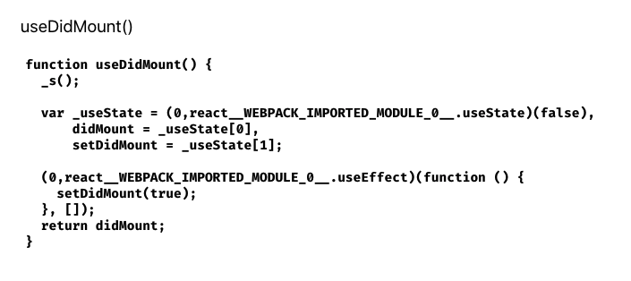
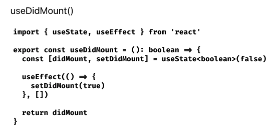

import { Link } from "gatsby"
import { SnippetToggler } from "../../../components/pages/snippets/SnippetToggler"
import { typeScriptCode } from "../../../components/utils/blog-posts/import-a-file-as-a-raw-string-in-gatsby-or-react/typeScriptCode"
import { javaScriptCode } from "../../../components/utils/blog-posts/import-a-file-as-a-raw-string-in-gatsby-or-react/javaScriptCode"

# Right to the Example

The [fully working CodeSandbox is here](https://codesandbox.io/s/boring-surf-tqtkc). Later on in this post, you'll see step-by-step how it's possible to build such a component for your own blog posts or site!

# Why Did I Need to Import Files as a Raw String?

Some readers have may have already explored the <Link to="/snippets">snippets page</Link>, where I've collected key snippets from across all my blog posts in the cleanest form possible. This was heavily inspired by [the snippets page on Josh Comeau's blog](https://www.joshwcomeau.com/snippets/).

I've added my own flair to my snippets page: I have snippets from all around the stack, including snippets from languages like C#, Python, and Node.js, and I think the TypeScript / JavaScript toggler I built is particularly cool! Later in this post, we'll go through a tutorial on how you can implement your own language toggler.

If you check out [the repo for this blog](https://github.com/princefishthrower/chrisfrew.in), you'll see that I have a folder with each snippet actually as a normal code file in it's own language (`.py` for python, `.cs` for C#, `.ts` for TypeScript, and so on). As we'll see by the end of this post, I actually import each of these files as a raw string and then syntax highlight them using the [`prism-react-renderer`](https://github.com/FormidableLabs/prism-react-renderer) library.

# Walkthrough of My First (Failed) Attempt

As a walkthrough, let's assume we want to just render a single snippet, which will be a React hook, just a normal ol' TypeScript file (`.ts` extension), `useDidMount.ts`. The actual code of the hook itself is the following:

```ts
import { useState, useEffect } from "react"

export const useDidMount = (): boolean => {
    const [didMount, setDidMount] = useState<boolean>(false)

    useEffect(() => {
        setDidMount(true)
    }, [])

    return didMount
}
```

To try to render this file on my blog here, I tried first naïvely to import the file directly and just calling `toString()` on it. 😂 Observe this example component which does that:

```tsx
import * as React from "react"
import { useDidMount } from "../snippets/useDidMount"

const ExampleComponent = () => {
    return (
        <>
            <p>useDidMount()</p>
            <pre>{useDidMount.toString()}</pre>
        </>
    )
}

export default ExampleComponent
```

The result of this component ends up looking like this if you were actually to see this in browser:



Yeah... the original source code of the snippet has been transformed and become all Webpack-y. Not useful at all for the developer visiting the site who wants the clean snippet code!

So it's clear that we can't use the standard `import` method to import our code snippets for rendering.

**We need to import them as raw strings.**

# The Solution

The solution was more challenging to find than I thought. There _is_ a package, [gatsby-remark-embed-snippet](https://www.gatsbyjs.com/plugins/gatsby-remark-embed-snippet/), which helps you embed code snippets from a file in Gatsby, but that is a remark plugin intended only for use in markdown (or MDX) files, and anyway as of writing this, that package's dependencies were not yet upgraded to be compatible with Gatsby V3, which my blog is using. My snippets page is _not_ an `.md` or `.mdx` file; it's a typescript react component, in a `.tsx` file, and I didn't want to refactor the entire page to `.md` or `.mdx`.

So, with some searching, I first found [this Stackoverflow post about importing a CSS file in a raw fashion](https://stackoverflow.com/questions/55205774/how-to-import-a-css-file-in-a-react-component-as-raw-text), as the original poster was creating a WYSIWYG editor, and wanted to render the CSS exactly as it was written in the editor. In that post, I found the answer:

**You need to use `require` with Webpack's `raw-loader` to import files as a raw string!**

Following the `useDidMount` example we've been using, that would be:

```typescript
const useDidMount = require("!!raw-loader!./useDidMount")
```

We can then render this variable using `useDidMount.default.toString()`, for example in a `<pre>` tag:

```tsx
<p>useDidMount()</p>
<pre>{useDidMount.default.toString()}</pre>
```

This will render the snippet's source code in the browser exactly as it appears in its source file, looking like this:



Perfect! That's exactly what we want! Now it's just a matter of syntax highlighting the actual code string, and we're off!

I created [a Stack Overflow question for this, which I answered myself](https://stackoverflow.com/a/66832315/2805387), but it was downvoted for some reason. 😞 I'm not sure why - I think my solution is the only one that works if you want to import files as raw strings into a Gatsby project into a non-markdown or MDX file!

## The Fun Part: How I make those fancy TypeScript / JavaScript Togglers on the Snippets Page!

So, with the knowledge we've learned so far in this post, I'll now provide a tutorial of how I actually build those snippet togglers on the <Link to="snippets">snippets page</Link>.

The name I chose for my snippet toggler component was... `SnippetToggler`! Essentially, we will need a label for what we want to call our snippet, the two file labels (one for javascript and one for TypeScript) and then the actual two code sources - which will come from the headache that was the whole `raw-loader` issue.

So, let's start with a skeleton of our component, setting up the interface contract for the props we will need:

```tsx
export interface ISnippetTogglerProps {
    snippetLabel: string
    fileLabels: Array<string>
    typeScriptCode: string
    javaScriptCode: string
}

export function SnippetToggler(props: ISnippetTogglerProps) {
    return <></>
}
```

So far so good. The first thing we'll need to do is to pull off all the props:

```tsx
export interface ISnippetTogglerProps {
    snippetLabel: string
    fileLabels: Array<string>
    typeScriptCode: string
    javaScriptCode: string
}

export function SnippetToggler(props: ISnippetTogglerProps) {
+  const {
+    snippetLabel,
+    fileLabels,
+    typeScriptCode,
+    javaScriptCode
+  } = props

  return <></>
}
```

Then let's think about the state we will need. We'll need a `boolean` state variable to let us know which of the two snippets to actually render. I called it `showJavaScript`. We'll then make use of an `activeModeText` and `className` which will help us change styles and the label when we toggle the snippet:

```tsx
export interface ISnippetTogglerProps {
    snippetLabel: string
    fileLabels: Array<string>
    typeScriptCode: string
    javaScriptCode: string
}

export function SnippetToggler(props: ISnippetTogglerProps) {
  const {
    snippetLabel,
    fileLabels,
    typeScriptCode,
    javaScriptCode
  } = props

+  const [showJavaScript, setShowJavaScript] = useState<boolean>(false)
+  const activeModeText = showJavaScript ? "JavaScript" : "TypeScript"
+  const className = activeModeText.toLowerCase()

  return <></>
}
```

Let's then start to think about render markup. I save the TypeScript and JavaScript version of the code block as two seperate `const` variables respectively:

```tsx
export interface ISnippetTogglerProps {
    snippetLabel: string
    fileLabels: Array<string>
    typeScriptCode: string
    javaScriptCode: string
}

export function SnippetToggler(props: ISnippetTogglerProps) {
  const {
    snippetLabel,
    fileLabels,
    typeScriptCode,
    javaScriptCode
  } = props

  const [showJavaScript, setShowJavaScript] = useState<boolean>(false)
  const activeModeText = showJavaScript ? "JavaScript" : "TypeScript"
  const className = activeModeText.toLowerCase()

+  const typeScriptBlock = (
+    <>
+        <code className={className}>{fileLabels[0]}</code>
+        <Pre
+            codeString={typeScriptCode}
+            language="typescript"
+        />
+    </>
+  )
+
+  const javaScriptBlock = (
+    <>
+        <code className={className}>{fileLabels[1]}</code>
+        <Pre
+            codeString={javaScriptCode}
+            language="javascript"
+        />
+    </>
+  )

  return <></>
}
```

where the `<Pre/>` component is yet another react component (it's rather involved due to the fact that we need javascript based, not markdown based syntax highlighting - here I've left out various parts of my own `<Pre/>` component, like a copy button and showing confetti when it is clicked. I've also fixed the syntax highlighting theme as `github`, but there are many other themes to choose from. See [my `<Pre/>` component on the repository to explore the full one](https://github.com/princefishthrower/chrisfrew.in/blob/master/src/components/CodeCopyButton/Pre.tsx).

```tsx
import React from "react"
import Highlight, { defaultProps, Language } from "prism-react-renderer"
import github from "prism-react-renderer/themes/github"

export interface IPreProps {
    codeString: string
    language: Language
}

export const Pre = (props: IPreProps) => {
    const { codeString, language } = props

    return (
        <Highlight
            {...defaultProps}
            code={codeString}
            language={language}
            theme={github}
        >
            {({ className, style, tokens, getLineProps, getTokenProps }) => (
                <pre
                    className={className}
                    style={{
                        ...style,
                        padding: "2rem",
                        position: "relative",
                        overflowX: "scroll",
                    }}
                >
                    {tokens.map((line, i) => (
                        <div {...getLineProps({ line, key: i })} style={style}>
                            {line.map((token, key) => (
                                <span {...getTokenProps({ token, key })} />
                            ))}
                        </div>
                    ))}
                </pre>
            )}
        </Highlight>
    )
}
```

Returning to our `<SnippetToggler/>` component, we can get to the `return` statement, adding in the actual switch component, and use the state variable `showJavaScript` to determine which of those `const` variables to render.

**We've arrived at the final version of our SnippetToggler component:**

```tsx
import * as React from "react";
import { useState } from "react";
import { Pre } from "./Pre";

export interface ISnippetTogglerProps {
  snippetLabel: string;
  fileLabels: Array<string>;
  typeScriptCode: string;
  javaScriptCode: string;
}

export function SnippetToggler(props: ISnippetTogglerProps) {
  const { snippetLabel, fileLabels, typeScriptCode, javaScriptCode } = props;

  const [showJavaScript, setShowJavaScript] = useState<boolean>(false);
  const activeModeText = showJavaScript ? "JavaScript" : "TypeScript";
  const className = activeModeText.toLowerCase();

  const typeScriptBlock = (
    <>
      <code className={className}>{fileLabels[0]}</code>
      <Pre codeString={typeScriptCode} language="typescript" />
    </>
  );

  const javaScriptBlock = (
    <>
      <code className={className}>{fileLabels[1]}</code>
      <Pre codeString={javaScriptCode} language="javascript" />
    </>
  );

+  return (
+    <>
+      <h3 className={className}>{snippetLabel}</h3>
+      <div>
+        <label className={`switch ${className}`}>
+          <input
+            type="checkbox"
+            onChange={() => setShowJavaScript(!showJavaScript)}
+            checked={showJavaScript}
+          />
+          <span className="slider round" />
+          <span className="switch-text snippet">
+            {activeModeText} Mode Active
+          </span>
+        </label>
+      </div>
+      {showJavaScript ? javaScriptBlock : typeScriptBlock}
+    </>
+  );
}
```

**Nice, we're done! 🎉**

Here's the SCSS I have for the colors and switch used in our `<SnippetToggler/>`, if you're interested:

```scss
$typeScriptBlue: #2f74c0;
$javaScriptYellow: #efd81c;
$width: 50px;
$height: 27px;
$lightColor: #ffffff;
$darkColor: #191919;

.switch {
    position: relative;
    text-align: center;
    display: inline-block;
    height: $height;

    & .switch-text {
        margin-top: 1rem;
        display: block;
    }

    & input {
        opacity: 0;
        width: 0;
        height: 0;
    }

    & .slider {
        width: $width;
        position: absolute;
        cursor: pointer;
        top: 0;
        left: 0;
        right: 0;
        bottom: 0;
        background-color: $lightColor;
        -webkit-transition: 0.4s;
        transition: 0.4s;
        margin: 0 auto;
    }

    & .slider:before {
        position: absolute;
        content: "";
        height: 19px;
        width: 20px;
        left: 4px;
        bottom: 4px;
        background-color: $darkColor;
        -webkit-transition: 0.4s;
        transition: 0.4s;
    }

    & input:checked + .slider {
        background-color: $darkColor;
    }
    & input:checked + .slider:before {
        background-color: $lightColor;
    }

    & input:focus + .slider {
        box-shadow: 0 0 1px $darkColor;
    }

    & input:checked + .slider:before {
        -webkit-transform: translateX(22px);
        -ms-transform: translateX(22px);
        transform: translateX(22px);
    }

    /* Rounded sliders */
    & .slider.round {
        border-radius: $height;
    }

    & .slider.round:before {
        border-radius: 50%;
    }
}

.switch.typescript {
    & .switch-text {
        color: $typeScriptBlue;
    }
    & .slider {
        background-color: $typeScriptBlue;
    }
}

.switch.javascript {
    & .switch-text {
        color: $javaScriptYellow;
    }
    & input:checked + .slider {
        background-color: $javaScriptYellow;
    }
}
```

# Working Example

I've put up [a CodeSandbox](https://codesandbox.io/s/boring-surf-tqtkc) with the full code referenced in this blog post if you'd like to take a look and fool around with it yourself. The SCSS is the minimum working example, so of course it won't look _exactly_ like the togglers you see on this blog, but it's pretty close!

Since I'm here in an MDX blog post, I can include the `<SnippetToggler/>` component right in this post! Here's one you can play with, identical to the CodeSandbox one:

<SnippetToggler
    snippetLabel="useDidMount()"
    snippetInfos={[
        {
            fileLabel: "useDidMount.ts",
            code: typeScriptCode,
            language: "typescript",
        },
        {
            fileLabel: "useDidMount.js",
            code: javaScriptCode,
            language: "javascript",
        },
    ]}
    pdfMode={false}
/>

Pretty neat, right!?

I still have future work planned for this component. Some ideas:

-   `context` prop, where I can reference what blog post or posts that I've used or shown the snippet
-   `description` prop that gives a brief overview of what the snippet does
-   `usage` prop that shows the function being called in some realistic looking context
-   `id` prop, so I can link to specific snippets, as I expect <Link to="snippets">the snippets page</Link> to get quite long

# Thanks!

As always, thanks for reading and I hope this post was useful to you! You now know how to import files as raw strings and do whatever you want with them in Gatsby and / or React!

Cheers! 🍻

-Chris
