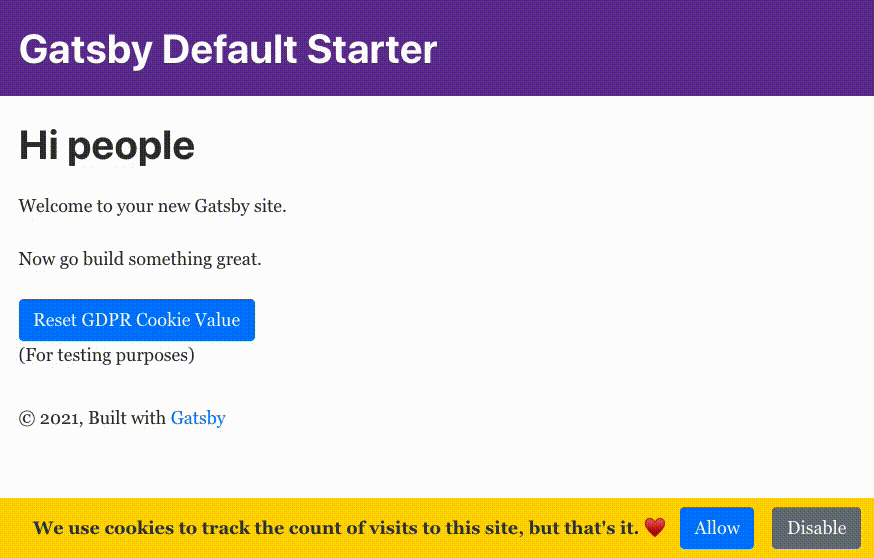

[Check out the GitHub Pages site running an example of the cookie component!](https://princefishthrower.github.io/gatsby-animated-gdpr-banner/)

_Disclaimer: I'm not a legal expert, so do your own due diligence for what is required for proper GDPR compliance._

# Prerequisites

This post assumes you are using a combination of the following:

-   Gatsby
-   React
-   TypeScript
-   Bootstrap

If you're using all these, **this is the perfect post for you.** Check out the [example site]() which has an empty Gatsby starter site to see the banner in action!

# The Base Component

Let's start by rendering a sticky footer using Bootstrap classes:

```tsx
import * as React from "react"

export function GDPRBanner() {
    return (
        <div className="fixed-bottom bg-gold p-2">
            <div className="row justify-content-center align-items-center">
                <span className="text-dark font-weight-bold mx-3">
                    We use cookies to track the count of visits to this site,
                    but that's it. ♥️
                </span>
                <button className="btn btn-primary mr-3">Allow</button>
                <button className="btn btn-secondary">Disable</button>
            </div>
        </div>
    )
}
```

It's a good start, but it's just static markup and has no actual functionality. It will just sit there and the buttons won't do anything when clicked.

# Adding Cookies and Cookie Interaction

Snooping around the Gatsby plugins site, I found the [gatsby-plugin-gdpr-cookies](https://www.gatsbyjs.com/plugins/gatsby-plugin-gdpr-cookies/) plugin.

We can install that with:

```bash
npm install --save gatsby-plugin-gdpr-cookies
```

and add it to our `gatsby-config.js` like so:

```
{
    resolve: `gatsby-plugin-gdpr-cookies`,
    options: {
    googleAnalytics: {
        trackingId: 'YOUR_GOOGLE_ANALYTICS_TRACKING_ID',
        cookieName: 'gatsby-gdpr-google-analytics',
        anonymize: true,
        allowAdFeatures: false
    },
}
```

There are more settings, but the scope of this post will focus on Google Analytics. You can extend the process here and extend the banner if you are using some of the other cooking-using tools like Facebook Pixel and so on.

So the cookie name for Google Analytics is `gatsby-gdpr-google-analytics`. To avoid hardcoding that around my app, I typically make a practice of creating a `Constants.ts` file, in which I reference reusable constant values like the cookie name. Let's create that now:

```ts
export class Constants {
    public static readonly GOOGLE_ANALYTICS_COOKIE_NAME =
        "gatsby-gdpr-google-analytics"
}
```

From the [gatsby-plugin-gdpr-cookies](https://www.gatsbyjs.com/plugins/gatsby-plugin-gdpr-cookies/) plugin documentation, when this cookie's value is set to `true`, the actual google analytics javascript will be executed. Any other value and it won't be.

I'm going to use the react package [react-cookie](https://www.npmjs.com/package/react-cookie) to easily be able to both get and set the value of this cookie:

```bash
npm install --save react-cookie
```

We can import the hook `useCookies` from that package in our component, and we'll utilize a small wrapper function `setCookieValue` to set the value. We can then use this wrapper function in the `onClick` prop of both the buttons:

```tsx
import * as React from "react"
+import { useCookies } from "react-cookie"

export function GDPRBanner() {

+    const [cookies, setCookie] = useCookies([
+        Constants.GOOGLE_ANALYTICS_COOKIE_NAME,
+    ])
+
+    const setCookieValue = (value: string) => {
+        setCookie(Constants.GOOGLE_ANALYTICS_COOKIE_NAME, value)
+    }

    return (
        <div className="fixed-bottom bg-gold p-2">
            <div className="row justify-content-center align-items-center">
                <span className="text-dark font-weight-bold mx-3">
                    We use cookies to track the count of visits to this site,
                    but that's it. ♥️
                </span>
+                <button className="btn btn-primary mr-3" onClick={() => setCookieValue("true")}>Allow</button>
+                <button className="btn btn-secondary" onClick={() => setCookieValue("false")}>Disable</button>
            </div>
        </div>
    )
}
```

# Adding Animations

Great, so we have functionality with getting and setting the cookie value. Let's add some animation to spice up our banner. We're going to use [react-reveal](), so we can install that now:

```bash
npm install --save react-reveal
```

We can add the `<Fade/>` component from `react-reveal` to our banner component, and wrap our banner div with it. I think the "bottom" effect makes the most sense for this sticky banner:

```tsx
import * as React from "react"
+import Fade from "react-reveal/Fade"
import { Constants } from "../../constants/Constants"

export function GDPRBanner() {
    const [cookies, setCookie] = useCookies([
        Constants.GOOGLE_ANALYTICS_COOKIE_NAME,
    ])

    const setCookieValue = (value: string) => {
        setCookie(Constants.GOOGLE_ANALYTICS_COOKIE_NAME, value)
    }

    return (
+        <Fade bottom>
            <div className="fixed-bottom bg-gold p-2">
                <div className="row justify-content-center align-items-center">
                    <span className="text-dark font-weight-bold mx-3">
                        We use cookies to track the count of visits to this
                        site, but that's it. ♥️
                    </span>
                    <button
                        className="btn btn-primary mr-3"
                        onClick={() => setCookieValue("true")}
                    >
                        Allow
                    </button>
                    <button
                        className="btn btn-secondary"
                        onClick={() => setCookieValue("false")}
                    >
                        Disable
                    </button>
                </div>
            </div>
+        </Fade>
    )
}
```

# Managing Animations

As it is now, the footer will animate into view every time someone visits the site, no matter if they have allowed or denied cookies. It also won't go away if they click either of the buttons. That's pretty annoying! We'll need a few logical additions to resolve these issues.

Luckily, `react-reveal` has a prop called `when`, if set to `true`, will fire the animation. Even better, the reverse also occurs: when the `when` prop goes from `true` to `false`, it will animate in reverse - in our case, leaving the screen.

Before doing anything complex in terms of cookie logic, we first need to know if the component is mounted - only then should we fire the fade animation - otherwise, we may get ugly animation flashing. For this, I use a nice utility hook I call `useDidMount`:

```ts
import { useState, useEffect } from 'react'

export function useDidMount() {
  const [didMount, setDidMount] = useState<boolean>(false)

  useEffect(() => {
    setDidMount(true)
  }, [])

  return didMount
}
```

We can import `useDidMount` and use it in our component, as well as in the `when` prop of the `<Fade/>` component:

```tsx
import * as React from "react"
import Fade from "react-reveal/Fade"
import { Constants } from "../../constants/Constants"
+import { useDidMount } from "../../hooks/useDidMount"

export function GDPRBanner() {
    const didMount = useDidMount()
    const [cookies, setCookie] = useCookies([
        Constants.GOOGLE_ANALYTICS_COOKIE_NAME,
    ])

    const setCookieValue = (value: string) => {
        setCookie(Constants.GOOGLE_ANALYTICS_COOKIE_NAME, value)
    }

    return (
+        <Fade bottom when={didMount}>
            <div className="fixed-bottom bg-gold p-2">
                <div className="row justify-content-center align-items-center">
                    <span className="text-dark font-weight-bold mx-3">
                        We use cookies to track the count of visits to this
                        site, but that's it. ♥️
                    </span>
                    <button
                        className="btn btn-primary mr-3"
                        onClick={() => setCookieValue("true")}
                    >
                        Allow
                    </button>
                    <button
                        className="btn btn-secondary"
                        onClick={() => setCookieValue("false")}
                    >
                        Disable
                    </button>
                </div>
            </div>
        </Fade>
    )
}
```

But we need to extend the `when` prop to include the case where we don't even need to show the banner - in the case that the cookie value is already set. Let's create a `const` called `needToShowBanner` which will do that, and add it to our `when` prop:

```tsx
import * as React from "react"
import Fade from "react-reveal/Fade"
import { Constants } from "../../constants/Constants"
import { useDidMount } from "../../hooks/useDidMount"

export function GDPRBanner() {
    const didMount = useDidMount()
    const [cookies, setCookie] = useCookies([
        Constants.GOOGLE_ANALYTICS_COOKIE_NAME,
    ])

    const setCookieValue = (value: string) => {
        setCookie(Constants.GOOGLE_ANALYTICS_COOKIE_NAME, value)
    }

+    const needToShowBanner =
+        cookies[Constants.GOOGLE_ANALYTICS_COOKIE_NAME] !== "true" &&
+        cookies[Constants.GOOGLE_ANALYTICS_COOKIE_NAME] !== "false"

    return (
+        <Fade bottom when={didMount && needToShowBanner}>
            <div className="fixed-bottom bg-gold p-2">
                <div className="row justify-content-center align-items-center">
                    <span className="text-dark font-weight-bold mx-3">
                        We use cookies to track the count of visits to this
                        site, but that's it. ♥️
                    </span>
                    <button
                        className="btn btn-primary mr-3"
                        onClick={() => setCookieValue("true")}
                    >
                        Allow
                    </button>
                    <button
                        className="btn btn-secondary"
                        onClick={() => setCookieValue("false")}
                    >
                        Disable
                    </button>
                </div>
            </div>
        </Fade>
    )
}
```

Nice. So the banner will only show if the cookie value is not valid. In other words, not set to `true` or `false`.

# Final Micro-Optimizations 

We're getting very close, but there are two last micro-optimizations we can make. 😄 

I found that my site loaded _so quickly_ (it's Gatsby, right? 😜), that it was best to add a bit of delay before showing the banner, otherwise the visitor may not even notice the banner fade in on the bottom. 

Luckily, `react-reveal` supports another prop, `delay`, which will delay the animation. I settled on 600 milliseconds for this value. `react-reveal` also supports a `duration` prop, which I set to 1000 milliseconds. I added both of these values to my `Constants` class, but feel free to tinker with their exact values: 

```tsx
export class Constants {
    public static readonly GOOGLE_ANALYTICS_COOKIE_NAME =
        "gatsby-gdpr-google-analytics"
+    public static readonly ANIMATION_DELAY = 600
+    public static readonly ANIMATION_DURATION = 1000
}
```

The second micro-optimization is this: when the visitor clicks one of the 'Allow' or 'Disable' buttons, we know we will be hiding the banner (via the `needToShowBanner` variable), but in the hiding animation, we _don't_ want a delay - we want a reaction immediately on the visitor's click. Therefore, we can set `delay`'s value via a ternary based off of `needToShowBanner`'s value, i.e.:

```tsx
const delay = needToShowBanner ? Constants.ANIMATION_DELAY : 0
```

With those additions, we've arrived at our final version of the component:

```tsx
import * as React from 'react'
import { useCookies } from 'react-cookie'
import Fade from 'react-reveal/Fade'
import { Constants } from '../../constants/Constants'
import { useDidMount } from '../../hooks/useDidMount'

export function GDPRBanner() {
  const didMount = useDidMount()
  const [cookies, setCookie] = useCookies([Constants.GOOGLE_ANALYTICS_COOKIE_NAME])

  const setCookieValue = (value: string) => {
    setCookie(Constants.GOOGLE_ANALYTICS_COOKIE_NAME, value)
  }

  const needToShowBanner =
    cookies[Constants.GOOGLE_ANALYTICS_COOKIE_NAME] !== 'true' && cookies[Constants.GOOGLE_ANALYTICS_COOKIE_NAME] !== 'false'
+  const delay = needToShowBanner ? Constants.ANIMATION_DELAY : 0

  return (
+    <Fade bottom delay={delay} when={didMount && needToShowBanner} duration={Constants.ANIMATION_DURATION}>
      <div className="fixed-bottom bg-gold p-2">
        <div className="row justify-content-center align-items-center">
          <span className="text-dark font-weight-bold mx-3">
            We use cookies to track the count of visits to this site, but that's it. ♥️
          </span>
          <button className="btn btn-primary mr-3" onClick={() => setCookieValue('true')}>
            Allow
          </button>
          <button className="btn btn-secondary" onClick={() => setCookieValue('false')}>
            Disable
          </button>
        </div>
      </div>
    </Fade>
  )
}
```

# We're Done!

Great! We've got a full life-cycle, nicely-styled, animated GDPR banner. The banner interacts with the actual value of the `gatsby-gdpr-google-analytics` cookie as the [gatsby-plugin-gdpr-cookies](https://www.gatsbyjs.com/plugins/gatsby-plugin-gdpr-cookies/) plugin requires, and we've even added smooth entry and exit animations via the `react-reveal` library.

**That's a wrap!**

Cheers! 🍻

-Chris