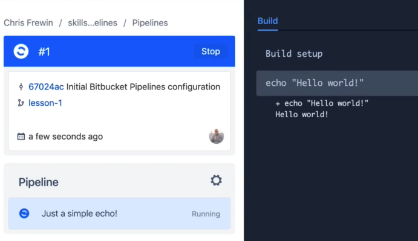
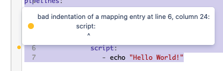

import LinkPreview from '../../../components/LinkPreview';
import Sparkles from '../../../components/Sparkles';

_[This post is mirrored on my Medium account.](https://chrisfrewin.medium.com/the-last-bitbucket-pipelines-tutorial-youll-ever-need-mastering-ci-and-cd-28a027fc5e40)_

# Are You Always Logging on to Your Server with SSH and Fighting with Your Builds and Deploys?

You've come to the right post. This post is going to be all about [Bitbucket Pipelines](https://bitbucket.org/product/features/pipelines). 

Full disclosure: I have _not_ been paid or otherwise sponsored by Atlassian to write this, I've just been a long time Bitbucket user and also find their CI / CD tool, Pipelines, incredibly powerful and useful! 

I also have a course available on [Skillshare](https://skl.sh/3bC2NMn) and [Udemy](https://www.udemy.com/course/mastering-bitbucket-pipelines/?referralCode=1D00780943BAE3B9685B), which takes a step-by-step deep dive into all the topics in this post, and much more!

As a totally free alternative (Bitbucket Pipelines is only free for a certain number of build minutes per month), you can check out [GitHub Actions](https://docs.github.com/en/actions) for a CI and CD tool geared towards open source projects. Though this post will be using the syntax and conventions for Bitbucket Pipelines, many of the concepts can carry over into the GitHub Actions world.

# Bitbucket Pipelines?

So what is Bitbucket Pipelines? Bitbucket Pipelines is another CI / CD tool, just like CircleCI or Travis CI: it's a framework where you can configure and execute specific operations on your repositories every time you push code to the origin. We can run tests, builds, and even SSH into our production servers, moving code or restarting processes, all the while being wired up with messaging hooks to stay informed while Pipelines does all the work for you! 

If you've been searching for a more customizable build and deploy tool outside of automated tools like Heroku and Netlify, Bitbucket Pipelines is for you! (For example, in the deploy with this blog, I do some gzip of files to make it even faster! :fire: Though here I am using GitHub Actions.) 

Enough housekeeping; let's get started with this tutorial.

# A "Hello World" Bitbucket Pipelines File

To get started, let's make a "Hello World" version of a Bitbucket pipelines configuration file. All Bitbucket Pipelines configuration files must be named `bitbucket-pipelines.yml`, and must sit in the root of your repository.

We then start the YAML file with `pipelines:` and `branches:` directives, and name our branch. This will be the branch that, when pushed to, will trigger the subsequent steps in our Pipelines file. 

Note that you can list multiple branches! This is a powerful feature of Pipelines, as we will see, for multiple environments, for example when you have both a test site and a production site. For now, I will use the git default branch name of `master` for our hello world pipeline. Combining all the directives mentioned, our Hello World pipelines file looks like this:

```yaml
pipelines:
  branches:
    master:
      - step:
          name: Our Very First Pipeline!
          script:
            - echo "Hello World!"
```

So after the `master` branch naming, I created what is known as a `step`. These steps appear partitioned and are labeled by the `name` in the Pipelines UI. For each step, we also can see the output of what was done within that given step, so it makes it easy to follow any build or integration later in time:



We also always have bash available to us in the pipelines environment, so I was able to go right ahead and run that `echo` command, without needing to import any libraries or anything inside our pipeline.

# Validating and Checking Pipeline Files

Bitbucket also provides [a tool to validate your pipeline YAML file](https://bitbucket-pipelines.prod.public.atl-paas.net/validator). Check it out, and copy and paste the above YAML file in to check! 

As an example of an _incorrectly_ formatted YAML file, try copy and pasting this one in:

```yml
pipelines:
  branches:
    master:
      - step:
          name: Our Very First Pipeline!
           script:
            - echo "Hello World!"
```

Huh... this file looks basically the same as the other one, right?! Did you see the error highlighted by the validator? Yep, our `script:` directive wasn't indented properly:



99% of the time your issues with the YAML files will be with formatting and indenting. I recommend using a good editor and perhaps a YAML library to avoid these indentation issues, and frequently calling a 'format' function within your editor to format the YAML indentation.

# Enough With the Beginner Stuff! Let's Make a Pipelines File for a Real Build!

Okay, so running a bash command in our pipelines is great and all, but let's make a real build.


Let's consider that we are running a React app using TypeScript, where we need to run some 'real' commands. Such a pipeline might look like this:

```yml
pipelines:
  branches:
    master:
      - step:
          name: Install npm modules with npm install and build production site via tsc
          script:
            - npm install
            - npm run build
```

Where our node `build` script would be nothing more than calling `tsc`, defined in `package.json` like so:

```json
...
"scripts": {
  "build": "tsc"
}
...
```

# Save Dist Folder and NPM Modules Artifacts

Ok, so we set up some 'real' build commands, and now we should actually do something with what was built! This requires the use of what are [known as artifacts](https://support.atlassian.com/bitbucket-cloud/docs/use-artifacts-in-steps/). Artifacts are files or folders produced by a step, and they tell bitbucket to keep a hold of those files or folders, to be used in later steps, like to sending those files or folders to your server!

A common pattern with TypeScript is to put all build artifacts into the `dist/` folder (via the [`outDir` config setting](https://www.typescriptlang.org/tsconfig#outDir)), so let's assume we have such settings ourselves. We'll use the `artifacts` directive right after the `script` directive in our pipelines config to tell Bitbucket that we want to hold on to both the `dist/` and `node_modules/` folders.

Let's also assume we've built a simple static server with express, and put that in an `index.js` file. This file won't be built during the process, it will just be a normal file checked into our repository - files that already exist in your repository are fine to declare as artifacts as well, of course! :smile:

```yml
pipelines:
  branches:
    master:
      - step:
          name: Install npm modules with npm install and build production site with npm run build
          script:
            - npm install
            - npm run build
          artifacts:
            - node_modules/**
            - dist/**
            - index.js
```

In the next section, we'll see that those those folders will be available in following Pipelines steps to us to use as we please.

# SCP to Copy Artifacts to Your Server of Choice

So we've got an install and build process, and we've got the artifacts from both processes. To continue this example, let's assume we want to do something with those artifacts - in this case, we'll [send them to a server of choice using SCP](https://support.atlassian.com/bitbucket-cloud/docs/deploy-using-scp/):

```yml
pipelines:
  branches:
    master:
      - step:
        name: Install npm modules and build production site via tsc
        script:
          - npm install
          - tsc
        artifacts:
          - node_modules/**
          - dist/**
          - index.js
      - step:
        name: Deploy dist artifacts using SCP
        deployment: production
        script:
          - pipe: atlassian/scp-deploy:0.3.3
            variables:
              USER: $USER
              SERVER: $SERVER
              REMOTE_PATH: '/var/www/your-first-pipeline-site/html'
              LOCAL_PATH: 'dist/*'
      - step:
        name: Deploy npm_modules artifacts using SCP
        deployment: production
        script:
          - pipe: atlassian/scp-deploy:0.3.3
            variables:
              USER: $USER
              SERVER: $SERVER
              REMOTE_PATH: '/var/www/your-first-pipeline-site'
              LOCAL_PATH: 'npm_modules/*'
      - step:
        name: Deploy index.js artifact using SCP
        deployment: production
        script:
          - pipe: atlassian/scp-deploy:0.3.3
            variables:
              USER: $USER
              SERVER: $SERVER
              REMOTE_PATH: '/var/www/your-first-pipeline-site'
              LOCAL_PATH: 'index.js'
```

**Note that this requires additional steps outside of the `pipelines.yml` file!** You will need to add both the USER and SERVER variables (referenced above as `$USER` and `$SERVER`) as Pipelines variables! [You can see detailed steps on how to configure Pipelines variables here.](https://confluence.atlassian.com/bitbucket/variables-in-pipelines-794502608.html#Variablesinpipelines-User-definedvariables)

# SSH to Login to Your Server of Choice

Now that we've got our artifacts sitting in the `var/www/your-first-pipeline-site` folder on the server, we'll log into the server with SSH and start up the `index.js` with `node index.js`. 

Luckily, we can use those same exact `$USER` and `$SERVER` variables from the last section in our SSH command:

```yml
pipelines:
  branches:
    master:
      - step:
        name: Install npm modules and build production site via tsc
        script:
          - npm install
          - tsc
        artifacts:
          - node_modules/**
          - dist/**
          - index.js
      - step:
        name: Deploy dist artifacts using SCP
        deployment: production
        script:
          - pipe: atlassian/scp-deploy:0.3.3
            variables:
              USER: $USER
              SERVER: $SERVER
              REMOTE_PATH: '/var/www/your-first-pipeline-site/html'
              LOCAL_PATH: 'dist/*'
      - step:
        name: Deploy npm_modules artifacts using SCP
        deployment: production
        script:
          - pipe: atlassian/scp-deploy:0.3.3
            variables:
              USER: $USER
              SERVER: $SERVER
              REMOTE_PATH: '/var/www/your-first-pipeline-site'
              LOCAL_PATH: 'npm_modules/*'
      - step:
        name: Deploy index.js artifact using SCP
        deployment: production
        script:
          - pipe: atlassian/scp-deploy:0.3.3
            variables:
              USER: $USER
              SERVER: $SERVER
              REMOTE_PATH: '/var/www/your-first-pipeline-site'
              LOCAL_PATH: 'index.js'
      - step:
        name: SSH to project root on server and start Node.js process
        script:
          - ssh $USER@$SERVER 'cd /var/www/your-first-pipeline-site && node index.js`
```
**Note that this type of pipeline will also require additional steps: you will need to set up your server to accept SSH connections from your repository!** [You can see how to set up SSH keys for your repository in detail here.](https://support.atlassian.com/bitbucket-cloud/docs/variables-and-secrets/#Use-SSH-keys-in-Bitbucket-Pipelines)

Yay! We've now got a full functioning CI: we install, build, save, and deploy our artifacts to the server, and even start up the server itself. Awesome! :rocket: 

There's still a small issue here with running `node index.js` on the server in our pipeline, but you'll have to [check out the full course to learn about that!](#courses)

# Bonus: Multi-Branch and Multi-Environment System

Let's look at a Pipelines file that supports multiple environments. As I mentioned earlier, perhaps you have a testing site and a production site, which correspond to the `staging` and `master` branches, respectively. Such a Pipelines configuration file might look like this:

```yml
pipelines:
  branches:
    staging:
      - step:
            name: Copy Staging Environment (.env.staging.json) to .env.json
            script:
                - cp /src/env/.env.staging.json /src/env/.env.json
                <<<rest of install, build, SCP, SSH scripts and commands>>>
    master:
      - step:
            name: Copy Production Environment (.env.production.json) to .env.json
            script:
                - cp /src/env/.env.production.json /src/env/.env.json
                <<<rest of install, build, SCP, SSH scripts and commands>>>
```

You'll note here I run a `cp` command which copies the corresponding environment for the given branch (the build would subsequently use only the values in `.env.json` during the following steps). I typically have the following environment setup folder and files:

```bash
env
├── .env.develop.json
├── .env.json
├── .env.production.json
└── .env.staging.json
```

Alternatively, you could make a series of TypeScript files, each with a class with `public static readonly` variables in it - though that is obviously much more dependent on if you are actually in a project using TypeScript. :smile:

Note that any of these env or config files _would_ be checked in to git, so they are valid only for public variables - perhaps titles, styles, etc. For secret variables, you'll still need to use other tools like `dotenv` or bash environment variables (`process.env` in Node.js, for example).

# Bonus: Add a Slack Bot and a Messaging Webhook

A fun thing to incorporate into Bitbucket Pipelines is a [Slack bot with a webhook](https://api.slack.com/apps), where you can fire off messages throughout various stages in your build or integration process, as well as at the moments where anything goes wrong. 

The simplest (though perhaps not cleanest) way to do it is to add a `curl` command right into your Pipelines file, which calls the Slack webhook URL with the message you want:

```yml
pipelines:
  branches:
    staging:
      - step:
            name: Copy Staging Environment (.env.staging.json) to .env.json
            script:
                - cp /src/env/.env.staging.json /src/env/.env.json
                - curl -X POST -H 'Content-type: application/json' --data '{"text":"Staging environment copied into environment!"}' YOUR_WEBHOOK_URL_HERE
    master:
      - step:
            name: Copy Production Environment (.env.production.json) to .env.json
            script:
                - cp /src/env/.env.production.json /src/env/.env.json
                - curl -X POST -H 'Content-type: application/json' --data '{"text":"Production environment copied into environment!"}' YOUR_WEBHOOK_URL_HERE
```

<a className="plain-link" name="courses"></a>

# Plug Time: Learn All This and More in my Bitbucket Pipelines Mastery Course!

My course, <Sparkles>Mastering Bitbucket Pipelines for CI and CD</Sparkles>, is available on Skillshare Premium and for $20 on Udemy:

<LinkPreview 
url="https://skl.sh/3bC2NMn" 
fallbackTitle="Skillshare - Mastering Bitbucket Pipelines" 
fallbackDescription="From the most basic build to the most complex project: everything you need to know about mastering Bitbucket Pipelines!"
fallbackImage="https://img-a.udemycdn.com/course/480x270/3765070_eaac.jpg?QZpEgCkMdRdJDNejra97c6FbpEFOR08RcZZvOsxohk3O-QOVivr_uVPm80o12aroMnrHf64jTu8UDQjmFoHcWn2yJy1MGVr4_MF0Sg1-cB6JIGDjbU6iWNSDzuoEYQ"/>

<LinkPreview 
url="https://www.udemy.com/course/mastering-bitbucket-pipelines/?referralCode=1D00780943BAE3B9685B" 
fallbackTitle="Udemy" 
fallbackDescription="From the most basic build to the most complex project: everything you need to know about mastering Bitbucket Pipelines!" 
fallbackImage="https://img-a.udemycdn.com/course/480x270/3765070_eaac.jpg?QZpEgCkMdRdJDNejra97c6FbpEFOR08RcZZvOsxohk3O-QOVivr_uVPm80o12aroMnrHf64jTu8UDQjmFoHcWn2yJy1MGVr4_MF0Sg1-cB6JIGDjbU6iWNSDzuoEYQ"/>

If you want to check out the first few lessons of the course as a preview, that's on YouTube:

<LinkPreview 
url="https://www.youtube.com/watch?v=9XhyJhNPWCc&list=PLOX_mQri1cCla7Y_eVCSwZtNjzzxyrlSf" 
fallbackTitle="Youtube (First Few Lessons)" 
fallbackDescription="From the most basic build to the most complex project: everything you need to know about mastering Bitbucket Pipelines!" 
fallbackImage="https://img-a.udemycdn.com/course/480x270/3765070_eaac.jpg?QZpEgCkMdRdJDNejra97c6FbpEFOR08RcZZvOsxohk3O-QOVivr_uVPm80o12aroMnrHf64jTu8UDQjmFoHcWn2yJy1MGVr4_MF0Sg1-cB6JIGDjbU6iWNSDzuoEYQ"/>

My courses always include a full code repository, step-by-step videos, walkthroughs, configurations, live testing, examples, and more!

# Thanks!

As always, thanks for reading, and I hope you learned a thing or two about Bitbucket Pipelines!

-Cheers! :beer:

Chris