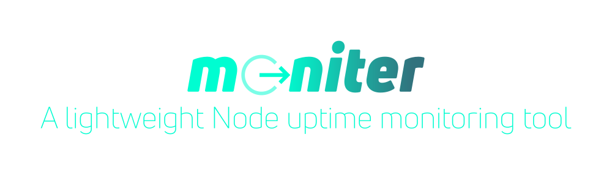

import FivePartProductSeries from "../../../components/utils/blog-posts/shared/FivePartProductSeries"

<FivePartProductSeries dontLinkURL="/blog/releasing-5-products-in-2021-part-2-moniter" isProductPage="true"/>

## Product Overview

The product, stylized as `moniter`, comes in two formats. The first is an npm package, which, because i'm using markdown in my blog here, I can embed the shield directly:

pretty cool, eh? Please consider starring [the GitHub repository](https://github.com/MoniterOrg/moniter) as well!

The second format, for those who don't have their own server instance perhaps or don't want to deal with all the config files (which are fairly extensive for a tool like `moniter`), we have built [moniter.org](https://moniter.org) (don't cringe yet, that was built in only about 20 hours at a Hackathon!). 

Our real first goal here is to provide a better feature set to our perhaps goliath competitor, [UptimeRobot](https://uptimerobot.com/) - basically to be frank we are going to undercut their free plan (50 moniters with 5-minute checks) with something like 100 moniters with 1 minute checks. 😄

The cool thing to note here: [moniter.org](https://moniter.org) is nothing more than GUI over the `moniter` tool! This is also the first time I've released a product that is mixed-source. That is, the moniter.org website and server code is private, but the tool that we use server side for that GUI is _identical_ to the `moniter` package - that means that whatever improvements are brought to `moniter`, our enterprise product can also benefit! We'll see how this model goes into the future, but I know I'm not the first, and many SaaS products are starting to adopt this model.

## Key Takeaways From Launch

Well, as for the launch, you're looking at it. 😅 I haven't really promoted it, and the website is fairly broken. I'll probably return to this post at some point to update with all the correct information. Just wanted to get my thoughts down on this product now that it is "released" hehe.

## Next Steps

There is a wide variety of TODOs for this tool. To keep it simple, I'll just list them here:

- Actually get payment flow working 😅 something weird happened with the stripe connection and accounts in general. That needs to be written up and fixed.
- Support regexs for sites or setup moniters automatically from a sitemap.xml - I would guess this is also a feature that UptimeRobot doesn't have
- Charts and graphs for the data - right now `moniter` is only strong in it's alert model. It doesn't yet have a data creation module for creating data lists that could be used for charts.
- Creation of a `precison` tier for the enterprise - this will be tricky as some servers may detect such fasting pinging as essentially a DDOS attack.
