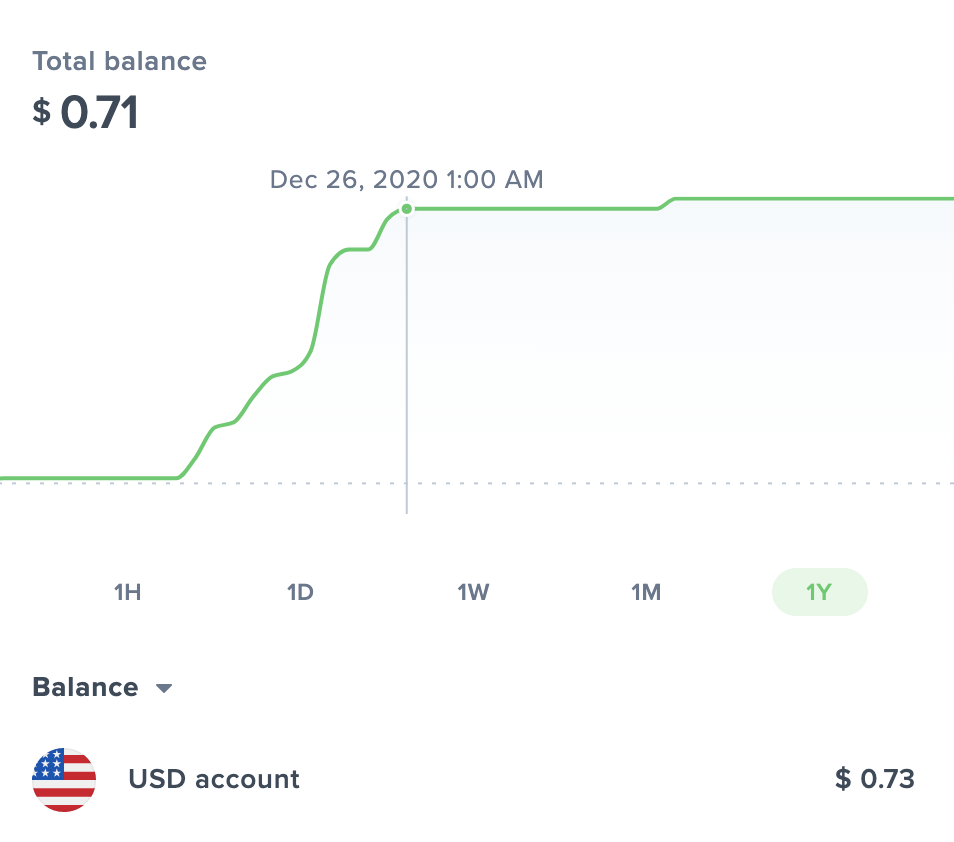

## How it Started

I promised in my year-old post, [Web Monetization - Using Coil and Uphold to Combat the Network Effect](/blog/web-monetization-using-coil-and-uphold-to-combat-the-network-effect/), that I would report back in a year as to how the results went from using Coil for a year.

## How It's Going

Not good. 😄

Look here, I've got a chart of my total earnings:

A meager 73 cents over a year long Coil subscription ($60.00)! 😱

To be clear, my blog gets anywhere from 800 - 1200 views per month. With these payout numbers, I suspect _at most_ 1-2 visitors had the Chrome Coil plugin installed - worse, all of these microtransactions you see on the chart were coming from my own account - visiting my blog at various times on the web as a sanity check that it was up and running - in which case that's more in the treadmill regime of things - I was literally recycling what I already payed in my $5 subscription 

## A Review of Coil and It's Pitfalls

[Coil](https://coil.com/about) markets itself as a way "to provide you with better ways to access and reward the creators, publishers and platforms that create the content you love." It is a micropayment system. To be fair, it is quite cool. You simply need to include your coil address in your page markup (in my case, using the [Gatsby web monetization plugin](https://www.gatsbyjs.com/plugins/gatsby-plugin-web-monetization/)).

The problem here with Coil is that creators will only recieve these micropayments from 

1. those who have an active Coil account 

and 

2. have the Google Chrome Coil Plugin installed.

These requirements are significant barriers to entry. So, while I was initially hope. Others have talked about such a system, such as Jaron Lanier in his book [Who Owns the Future?](https://www.goodreads.com/book/show/15802693-who-owns-the-future). He envisions a rich attribution-based internet, where all digital contributions on the web to any product or project are correspondingly back calculated. In his vision, no custom work would be needed, as is required for example with Coil. The attribution would be built _directly_ into the HTTP protocol. (Subsequently, if you were to make a 'viral' product - that was used in hundreds of thousands of projects later on - these contributions to so many projects would eventually decay with time - otherwise you risk running into winner-take-all scenarios we see all too often today.) 

The problem is not an easy one to solve, as evidenced by many of our negative externality issues that remain to be solved.

## The Creation of Positive Externalites, or the Win-Win-Win Situation

So it would seem my hopeful experiment with Coil didn't amount to much. But I'm still hopeful as to what the future brings - and I'm sure Coil works quite well for some individiuals out there with larger followings - [Coil is a physical company, with real people, working on it ever day](https://coil.com/about). Who knows - perhaps they will be part of this multifaceted solution in the future. 

I'm also working on a variety of things that attempt to combat these negative externalities. The only way I see it is to fight fire with fire. In other words, we'll need to find ways as a society to generate _positive externalities_, if you will. I've realized [the attribution and network effect issues raised in my first blog post on this topic](/blog/web-monetization-using-coil-and-uphold-to-combat-the-network-effect/) on the internet are just one negative externality out of many.

I argue that nearly all major issues of our time (income inequality, climate change, global housing complications) arise from negative. This is why I think it is critical to solve them, and that there must be a way to solve them, since we created them.

In a recent discussion with a few friends, we argued that perhaps the model behind NFTs, or services like BitClout (sharing property and profit of single items - such as paintings - wether in the real world or digital - or investing in people and their projects) may be one of these positive externalities that everyone involved in benefits in! Perhaps the reasons like true socialism (and that dreaded M word that I hate - you know the one) were simply because individuals couldn't trust eachother. Blockchain would be able to solve that.

One thing is sure - I have a lot of more exploration and research to do on these topics.

Until next time.

Cheers! 🍻

-Chris