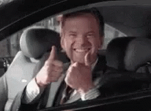

The motivation to write this post has come to me over the past few weeks as there has been another [wave of scary environmental press from the UN](https://www.theguardian.com/environment/2018/dec/03/david-attenborough-collapse-civilisation-on-horizon-un-climate-summit), and of course the [next set of climate talks in Katowice, Poland that are currently taking place](https://unfccc.int/katowice)

I often see that individuals have general feelings of despair and nihilism about climate change: that the problem is too big, that one person can't make a difference, and so on. That is a problem in and of itself! If the default feeling is one of hopelessness, well guess what? The culture around environmental protection, climate change, and the like, will be one of hopelessness!

But, I have a fix for that! 

 
Yes!

I've generated a simple list of actions you can take -all of which I already am doing myself, so that I can't be called hypocritical :) 

I'll admit, this is a bit of moral showboating on my part, but at the same time, these are things that, once you make the switch, you don't really need to think about them anymore. It's a one-time action, so get out there and make the switch! 

So, here's my simple list. I invite you to 'make the switch' to all of them, and to think of any of your own!

- Paying 5-10% extra per month for renewable energy from the grid (I believe most energy providers have this option these days - and yes, we know the electrons in the grid come from a variety of sources, the majority of them, unfortunately, still fossil fuel sources, but the electricity company uses the money that you pay extra to in turn pay those renewable energy providers, such as wind and solar, ultimately encouraging them to grow and creating a positive adoption feedback cycle)
- Eating meat a maximum of once per week max (if you're doing even less, great!)
- Not owning a car (feet, bikes, and buses rule!) Also, I have to admit I've been overly skeptical of the public transportation system in the US, spoiled by the system here in Europe - but I've found between local city / state bus routes, Greyhound, and Amtrak, our situation in the US is not so bad - it's just that our country is so damn big that public transportation seems relatively ridiculous :)
- Buying groceries grown / produced locally (this one is already well underway around the world and most of the time quite easy to follow, and I'm pleased to see it develop)
- (I almost forgot this last one!) No air conditioning - suck it up, it's not that hot. What do you think, hmmm let's see... _all of humanity did_ before [1902](https://www.google.com/search?q=what+year+was+air+condition+invented&oq=what+year+was+air+condition+invented&aqs=chrome..69i57j69i64.6281j0j7&sourceid=chrome&ie=UTF-8)? (Let me be clear: they didn't die because they didn't have air conditioning... obviously :wink:)

You'll also find that these points, while providing environmental benefit, are the exact same points that early-retirement hero [Mr. Money Moustache (MMM) also touts as excellent money savers](http://www.mrmoneymustache.com/2016/03/15/mother-earth/)! (If you don't know who MMM is, here's a one sentence overview: MMM is a super thrifty guy who was in the workforce for 10 years and 10 years alone, saving a huge majority of his income, and retired with his wife at age 30. For personal finance, his blog is a great one. Okay that, including this, makes three sentences :joy:)

Actually, the benefits from these points would ultimately flourish in a multi-fold fashion, if _everyone_ adopted them. Just as I write this post, with no extra critical thinking, I can immediately think of a few benefits that would emerge:
- cleaner air where population density is high (no personal cars, hopefully just environmentally friendly or alternative fuel / electric public transportation)
- higher respect for meat as a luxury item, and thus higher respect and treatment of livestock (and likely higher quality, and more income for farmers!).

Granted, I admit that I have probably a slight advantage in that the nature of my work as a software engineer I can work from home (or really anywhere), which of course gives rise to my non-existent need of a car.

I'll also concede that 'just following a list of things' is a bit naïve to solve the beast that is climate change, but it's a start.

The crucial point comes back to what I said at the beginning of this post: if you are hopeless by default, you probably won't even take these points to heart, thinking any effort is useless. 

These are things that _everyone_ needs to do to be effective. 

**But 'everyone' always starts with just one person.**

Cheers! :beer:

Chris