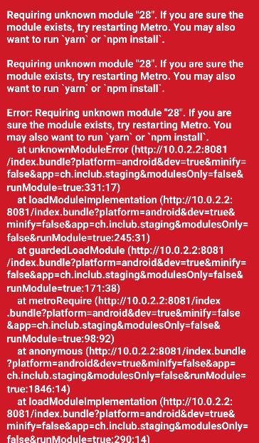

So you're hacking along on a React Native project, when you get the dreaded "unknown module" red screen of death:



Ah, the classic and cryptic "requiring unknown module" error... Well, crap. It's 4 PM and you've been hacking along on that feature all day. It was just working, where did you go wrong? You've surely missed a small import somewhere, or Visual Studio Code imported the wrong library or something like that.. You look at git - over 20 files modified since last commit. Crap! Gotta hunt down that sour import by hand now...

Sound familiar? This is how I used to feel when first I started out with application development, especially with React Native where the errors from the Metro bundler can be so uninformative (what the heck even _is_ module "28"?!).

Since adopting TypeScript for all React Native projects I work on, I slowly began to realize there is a _much_ better way to hunt down these issues: simply issuing the `tsc` command.

## `tsc` as Your Project's Type Doctor

While it's true we are always using TypeScript and IntelliSense directly in our files, it'd be nice if we could get a static overview of the entire project, right? In nearly all of my projects that use TypeScript, I have the following entry in my `package.json`:

```json
"type-check": "tsc --noEmit"
```

Go ahead and try this command right now on your TypeScript projects, i.e. `npm run type-check`. If you're a true legend (or perhaps you've been cleanly building your project with TypeScript from scratch), this should produce no output. More realistically, however, if you've adopted a legacy JavaScript project, or have let in the entropy that _is_ software development slowly crawl into your project, or heck, _if you were just plain lazy_ you'll see anywhere from dozens to hundreds of lines of all the warnings that TypeScript has found.

(As a side note: ideally, this should be the first step in your testing pipeline, since `tsc --noEmit` will only return code `0` in bash if your project truly has no type errors or warnings. Then you can run in a series before running your tests, i.e. `npm run type-check && npm run test`)

Ok... but what about that original error? The red screen of death with the cryptic "requiring unknown module" error?

Now we can get fancy.

A good first test is to pipe the output from `tsc` to `grep 'Cannot find module'`:

```shell
tsc --noEmit | grep 'Cannot find module'
```

An example output might look like this:

```
src/screens/MyScreen.tsx(19,20): error TS2307: Cannot find module './stylez' or its corresponding type declarations.
```

Aha! We've already found our issue. It was just a typo in our import! We misspelled `styles` with `stylez`. Problem solved.

<!-- ## Introducing `type-doc`

I liked the idea of parsing tsc's output so much I created a small repo for it, called `type-doc`: 

GitHub Preview for `type-doc`

It's exactly what this post describes: it's an opinionated parser of `tsc`'s output that can take a variety of options and customizations to focus on the output you or your team needs. However, note that you (or your organization's) goal should be to reach 0 TypeScript errors or warnings across the entire project. A doctor should only be used when your code is sick, and then you can do away with them! 😄

Of course I'll be quite happy if you check out and decide to use `type-doc`, but don't shy away from the simplicity of just cooking up your own command in your `package.json` file.

Cheers,

Chris -->